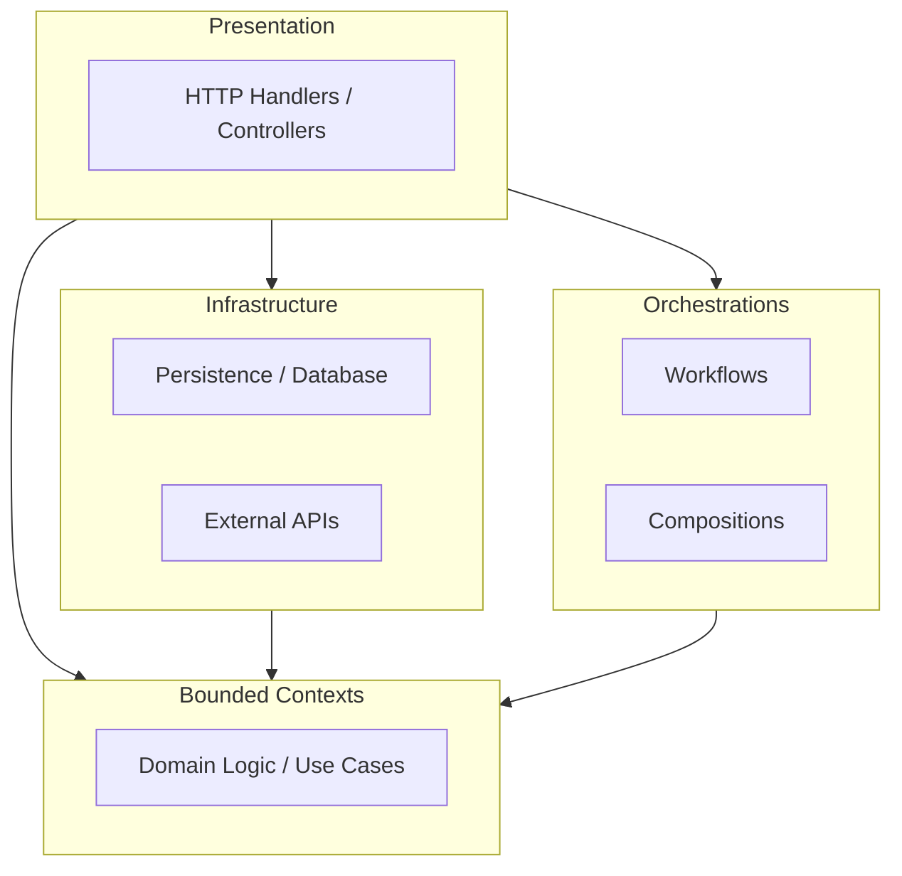

> **Layer by layer, dependency inward, business at the core.**

A DDD + Hexagonal architecture with framework-free business logic. Each layer has a distinct purpose, dependencies flow inward, and contracts are the shared source of truth.

## Architecture at a Glance

## Core Principles

1.  **Business Logic is Framework-Free**: Domain code never knows about HTTP or databases.
2.  **Dependencies Flow Inward**: Outer layers depend on inner layers.
3.  **Contracts are Source of Truth**: DTOs and interfaces define how layers interact.

## Getting Started

Check out the [New Endpoint Guide](/docs/guides/new-endpoint) to see how to build a feature from scratch.
