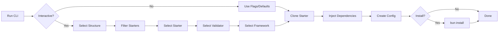
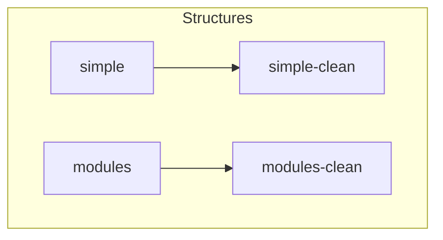
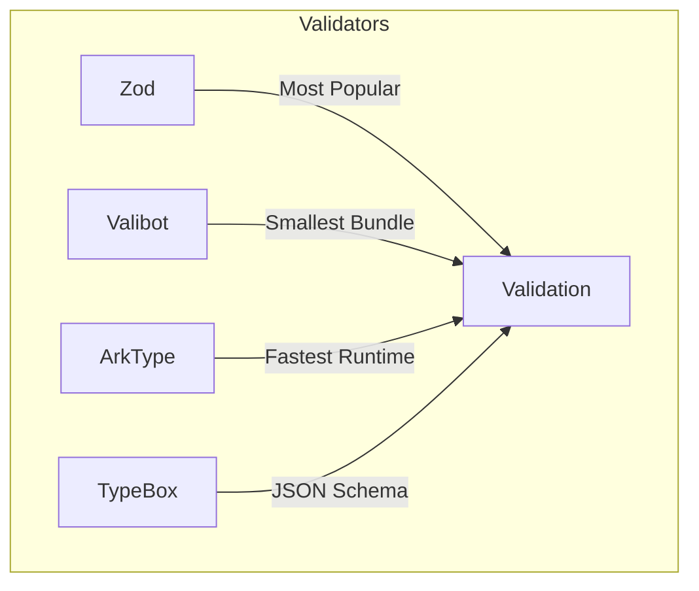

# create-onion-lasagna-app

Scaffold new onion-lasagna projects with a single command.

```bash
bunx create-onion-lasagna-app my-app
```

## Quick Start

```bash
# Interactive mode (recommended)
bunx create-onion-lasagna-app

# With project name
bunx create-onion-lasagna-app my-app

# Skip prompts with defaults
bunx create-onion-lasagna-app my-app --yes

# Full customization
bunx create-onion-lasagna-app my-app --structure simple -s simple-clean -v zod -f hono
```

## How It Works



## Options

| Flag | Alias | Description | Values |
|------|-------|-------------|--------|
| `--structure` | - | Project structure | `simple`, `modules` |
| `--starter` | `-s` | Starter template (filtered by structure) | See below |
| `--validator` | `-v` | Validation library | `zod`, `valibot`, `arktype`, `typebox` |
| `--framework` | `-f` | Web framework | `hono`, `elysia`, `fastify` |
| `--yes` | `-y` | Skip prompts, use defaults | - |
| `--no-install` | - | Skip dependency installation | - |
| `--help` | `-h` | Show help | - |

## Structures & Starters



### Simple Structure

Flat structure for small to medium projects.

| Starter | Description |
|---------|-------------|
| `simple-clean` | Minimal setup, ready to build |

```
my-app/
├── packages/
│   └── backend/
│       ├── bounded-contexts/
│       │   └── example/
│       ├── orchestrations/
│       └── shared/
├── .onion-lasagna.json
└── package.json
```

### Modules Structure

Module-based structure for large enterprise projects.

| Starter | Description |
|---------|-------------|
| `modules-clean` | Minimal setup, ready to build |

```
my-app/
├── packages/
│   ├── backend-modules/
│   │   ├── user-management/
│   │   ├── billing/
│   │   └── notifications/
│   └── backend-orchestrations/
├── .onion-lasagna.json
└── package.json
```

## Smart Starter Filtering

The CLI automatically filters starters based on your selected structure:

```bash
# Only shows simple-* starters
bunx create-onion-lasagna-app my-app --structure simple

# Only shows modules-* starters
bunx create-onion-lasagna-app my-app --structure modules
```

If an incompatible starter is specified, the CLI will error:

```bash
# Error: Starter "modules-clean" is not compatible with structure "simple"
bunx create-onion-lasagna-app my-app --structure simple -s modules-clean
```

## Validators



| Library | Best For |
|---------|----------|
| **Zod** | TypeScript-first, great inference, large ecosystem |
| **Valibot** | Bundle size critical apps, tree-shakeable |
| **ArkType** | Performance critical, complex schemas |
| **TypeBox** | JSON Schema compatibility, OpenAPI |

## Frameworks

| Framework | Runtime | Best For |
|-----------|---------|----------|
| **Hono** | Any (Node, Bun, Deno, Edge) | Universal deployment |
| **Elysia** | Bun | Maximum performance, end-to-end type safety |
| **Fastify** | Node | Enterprise, large plugin ecosystem |

## Generated Files

After scaffolding, you'll find:

| File | Purpose |
|------|---------|
| `.onion-lasagna.json` | Project configuration (structure, starter, validator, framework) |
| `packages/backend/.env` | Environment variables |
| `packages/backend/.env.example` | Environment template |

## Examples

```bash
# Simple API with Hono + Zod
bunx create-onion-lasagna-app api --structure simple -s simple-clean -v zod -f hono

# Enterprise monolith with Fastify + Valibot
bunx create-onion-lasagna-app platform --structure modules -s modules-clean -v valibot -f fastify

# High-performance Bun app with Elysia + ArkType
bunx create-onion-lasagna-app service --structure simple -v arktype -f elysia -y

# Quick prototype (all defaults: simple structure, simple-clean, zod, hono)
bunx create-onion-lasagna-app prototype --yes
```

## After Scaffolding

```bash
cd my-app
bun run dev    # Start development server
bun run build  # Build for production
bun run test   # Run tests
```

## Configuration

The `.onion-lasagna.json` file stores your project settings:

```json
{
  "structure": "simple",
  "starter": "simple-clean",
  "validator": "zod",
  "framework": "hono",
  "createdAt": "2024-01-15T10:30:00.000Z"
}
```

This config is used by `onion-lasagna-cli` for code generation.

## Adding New Starters

New starters can be added to either structure. The naming convention is:

- `{structure}-{name}` (e.g., `simple-clean`, `modules-clean`)

The CLI will automatically pick them up and show them when the matching structure is selected.
