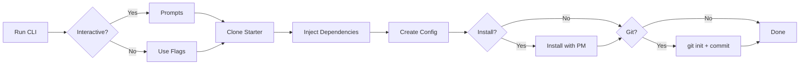
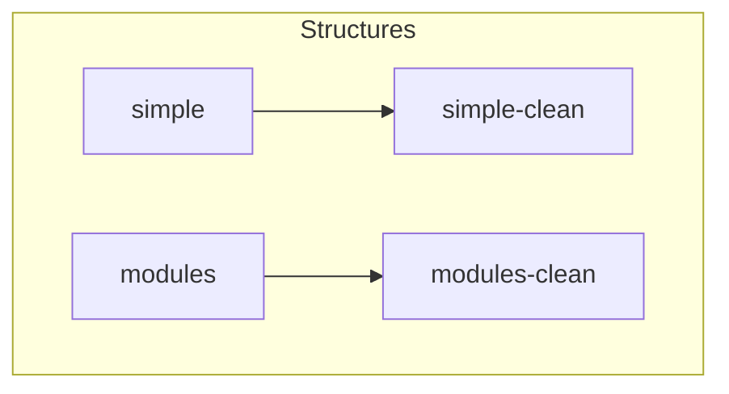
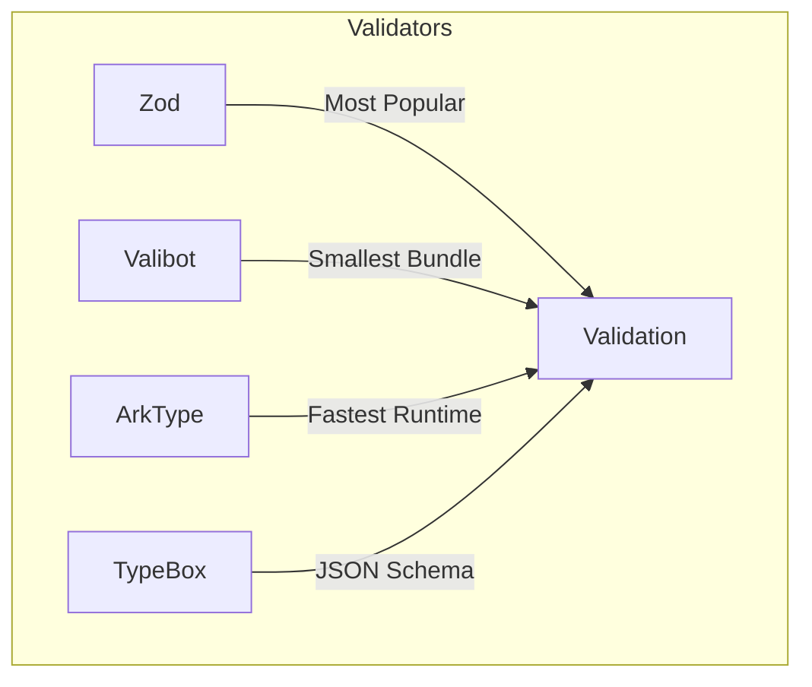

# create-onion-lasagna-app

Scaffold new onion-lasagna projects with a single command.

```bash
bunx create-onion-lasagna-app my-app
```

## Quick Start

```bash
# Interactive mode (recommended)
bunx create-onion-lasagna-app

# With project name
bunx create-onion-lasagna-app my-app

# Skip prompts with defaults
bunx create-onion-lasagna-app my-app --yes

# Full customization
bunx create-onion-lasagna-app my-app --structure simple -s simple-clean -v zod -f hono --use-pnpm
```

## How It Works



## Options

| Flag | Alias | Description | Default |
|------|-------|-------------|---------|
| `--structure` | - | Project structure: `simple`, `modules` | `simple` |
| `--starter` | `-s` | Starter template (filtered by structure) | Auto |
| `--validator` | `-v` | Validation: `zod`, `valibot`, `arktype`, `typebox` | `zod` |
| `--framework` | `-f` | Framework: `hono`, `elysia`, `fastify` | `hono` |
| `--use-bun` | - | Use bun package manager | Auto-detect |
| `--use-npm` | - | Use npm package manager | - |
| `--use-yarn` | - | Use yarn package manager | - |
| `--use-pnpm` | - | Use pnpm package manager | - |
| `--skip-git` | `-g` | Skip git initialization | `false` |
| `--no-install` | - | Skip dependency installation | `false` |
| `--yes` | `-y` | Skip prompts, use defaults | - |
| `--version` | `-V` | Show version number | - |
| `--help` | `-h` | Show help | - |

## Package Manager

The CLI auto-detects your package manager based on how you invoke it:

```bash
bunx create-onion-lasagna-app my-app   # Uses bun
npx create-onion-lasagna-app my-app    # Uses npm
pnpm create onion-lasagna-app my-app   # Uses pnpm
yarn create onion-lasagna-app my-app   # Uses yarn
```

Override with explicit flags:

```bash
bunx create-onion-lasagna-app my-app --use-pnpm
npx create-onion-lasagna-app my-app --use-bun
```

## Git Initialization

By default, the CLI initializes a git repository with an initial commit:

```bash
# Default: git init + initial commit
bunx create-onion-lasagna-app my-app

# Skip git initialization
bunx create-onion-lasagna-app my-app --skip-git
```

## Structures & Starters



### Simple Structure

Flat structure for small to medium projects.

| Starter | Description |
|---------|-------------|
| `simple-clean` | Minimal setup, ready to build |

```
my-app/
├── packages/
│   └── backend/
│       ├── bounded-contexts/
│       │   └── example/
│       ├── orchestrations/
│       └── shared/
├── .onion-lasagna.json
└── package.json
```

### Modules Structure

Module-based structure for large enterprise projects.

| Starter | Description |
|---------|-------------|
| `modules-clean` | Minimal setup, ready to build |

```
my-app/
├── packages/
│   ├── backend-modules/
│   │   ├── user-management/
│   │   ├── billing/
│   │   └── notifications/
│   └── backend-orchestrations/
├── .onion-lasagna.json
└── package.json
```

## Smart Starter Filtering

The CLI automatically filters starters based on your selected structure:

```bash
# Only shows simple-* starters
bunx create-onion-lasagna-app my-app --structure simple

# Only shows modules-* starters
bunx create-onion-lasagna-app my-app --structure modules
```

If an incompatible starter is specified, the CLI will error:

```bash
# Error: Starter "modules-clean" is not compatible with structure "simple"
bunx create-onion-lasagna-app my-app --structure simple -s modules-clean
```

## Validators



| Library | Best For |
|---------|----------|
| **Zod** | TypeScript-first, great inference, large ecosystem |
| **Valibot** | Bundle size critical apps, tree-shakeable |
| **ArkType** | Performance critical, complex schemas |
| **TypeBox** | JSON Schema compatibility, OpenAPI |

## Frameworks

| Framework | Runtime | Best For |
|-----------|---------|----------|
| **Hono** | Any (Node, Bun, Deno, Edge) | Universal deployment |
| **Elysia** | Bun | Maximum performance, end-to-end type safety |
| **Fastify** | Node | Enterprise, large plugin ecosystem |

## Generated Files

After scaffolding, you'll find:

| File | Purpose |
|------|---------|
| `.onion-lasagna.json` | Project config (structure, starter, validator, framework, packageManager) |
| `.git/` | Initialized git repository with initial commit |
| `packages/backend/.env` | Environment variables |
| `packages/backend/.env.example` | Environment template |

## Examples

```bash
# Simple API with Hono + Zod (defaults)
bunx create-onion-lasagna-app api --yes

# Enterprise monolith with Fastify + Valibot + pnpm
bunx create-onion-lasagna-app platform --structure modules -v valibot -f fastify --use-pnpm

# High-performance Bun app with Elysia + ArkType, no git
bunx create-onion-lasagna-app service -v arktype -f elysia --skip-git

# CI/CD: npm, no install, no git
npx create-onion-lasagna-app test-app --yes --no-install --skip-git
```

## After Scaffolding

```bash
cd my-app
bun run dev    # Start development server
bun run build  # Build for production
bun run test   # Run tests
```

Post-install instructions adapt to your selected package manager:

```bash
# If you used --use-pnpm
cd my-app
pnpm dev
```

## Configuration

The `.onion-lasagna.json` file stores your project settings:

```json
{
  "structure": "simple",
  "starter": "simple-clean",
  "validator": "zod",
  "framework": "hono",
  "packageManager": "bun",
  "createdAt": "2024-01-15T10:30:00.000Z"
}
```

This config is used by `onion-lasagna-cli` for code generation.

## Adding New Starters

New starters can be added to either structure. The naming convention is:

- `{structure}-{name}` (e.g., `simple-clean`, `modules-clean`)

The CLI will automatically pick them up and show them when the matching structure is selected.
