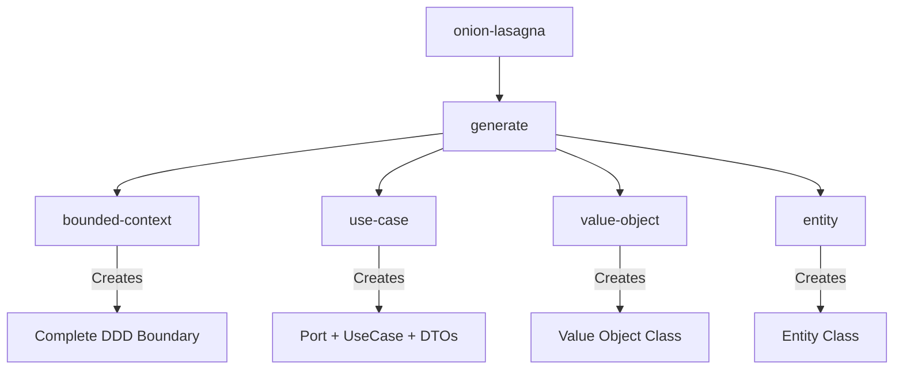
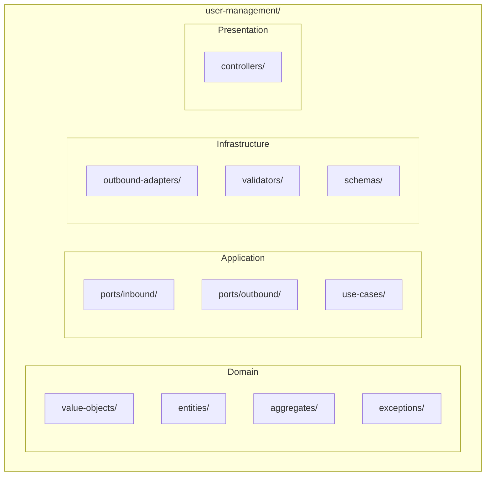
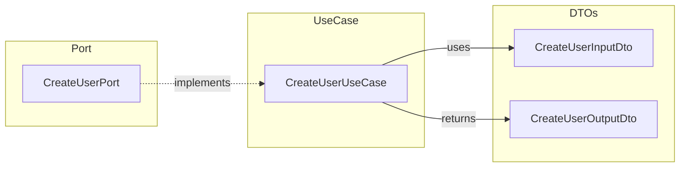
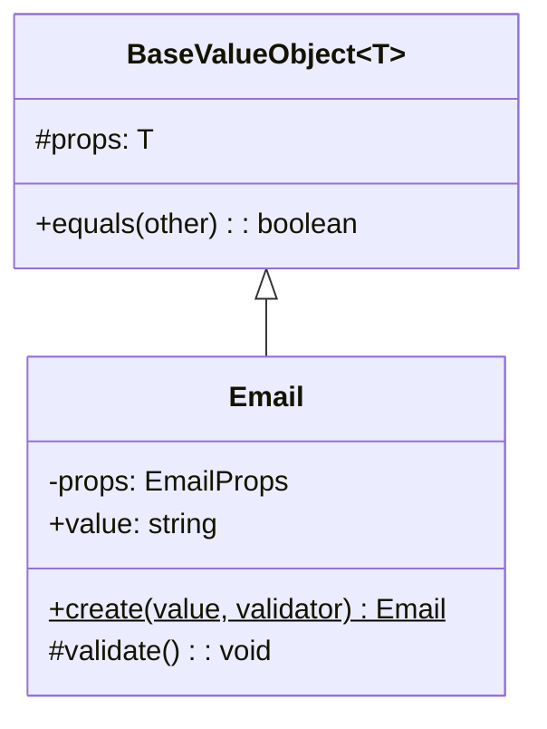
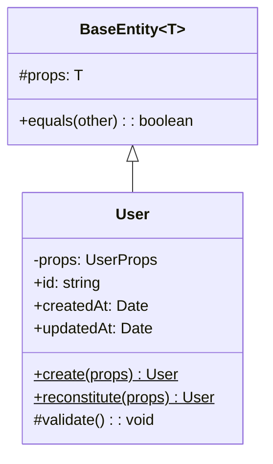
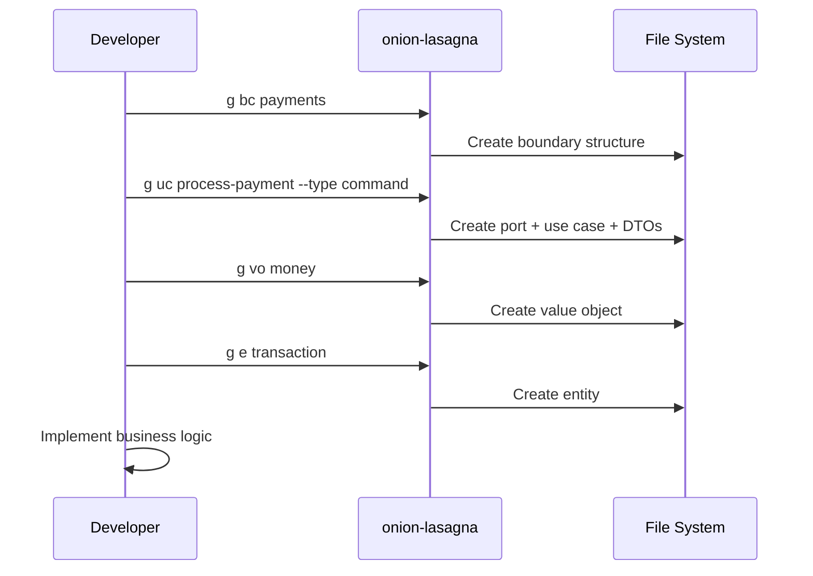
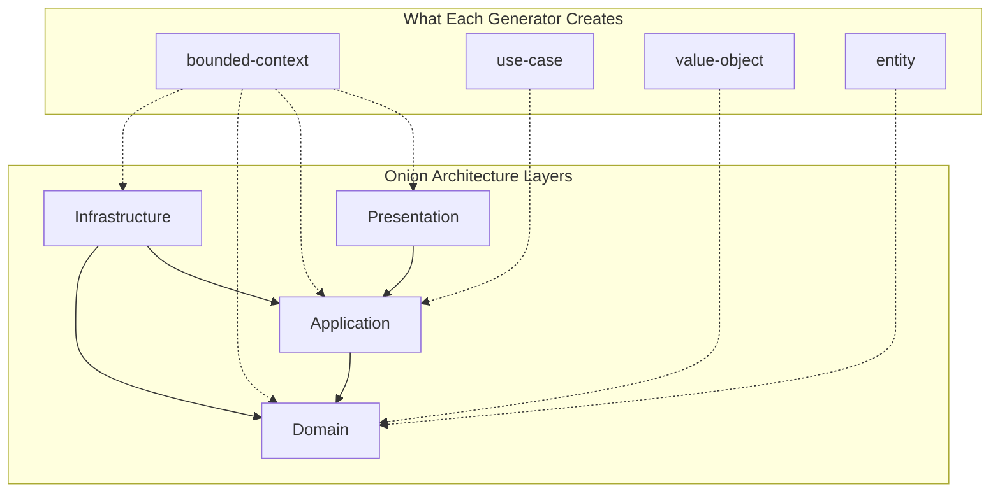

# onion-lasagna-cli

Development CLI for generating code scaffolds in onion-lasagna projects.

```bash
bunx onion-lasagna generate bounded-context user-management
```

## Quick Start

```bash
# Interactive mode
bunx onion-lasagna

# Generate a bounded context
bunx onion-lasagna g bc payments

# Generate a use case
bunx onion-lasagna g uc create-order --type command

# Generate a value object
bunx onion-lasagna g vo money

# Generate an entity
bunx onion-lasagna g e order
```

## Commands



| Command | Alias | Description |
|---------|-------|-------------|
| `generate bounded-context <name>` | `g bc` | Create a new bounded context |
| `generate use-case <name>` | `g uc` | Create a command or query |
| `generate value-object <name>` | `g vo` | Create a value object |
| `generate entity <name>` | `g e` | Create an entity |

## Generators

### Bounded Context

Creates a complete DDD boundary with all layers.

```bash
onion-lasagna g bc user-management
```



**Generated Structure:**

```
bounded-contexts/user-management/
├── domain/
│   ├── value-objects/
│   │   └── index.ts
│   ├── entities/
│   │   └── index.ts
│   ├── aggregates/
│   │   └── index.ts
│   ├── exceptions/
│   │   └── index.ts
│   └── index.ts
├── app/
│   ├── ports/
│   │   ├── inbound/
│   │   │   ├── commands/
│   │   │   └── queries/
│   │   └── outbound/
│   ├── use-cases/
│   │   ├── commands/
│   │   └── queries/
│   └── index.ts
├── infra/
│   ├── outbound-adapters/
│   ├── validators/
│   ├── schemas/
│   └── index.ts
├── presentation/
│   ├── controllers/
│   └── index.ts
└── index.ts
```

---

### Use Case

Creates a command or query with its port and DTOs.

```bash
# Interactive (prompts for type)
onion-lasagna g uc create-user

# Command (modifies state)
onion-lasagna g uc create-user --type command

# Query (reads data)
onion-lasagna g uc get-user-by-id --type query
```



**Generated Files:**

```
app/
├── ports/inbound/commands/
│   ├── create-user.port.ts      # Port interface
│   └── index.ts                 # Updated exports
└── use-cases/commands/create-user/
    ├── createUser.dto.ts        # Input/Output DTOs
    ├── createUser.use-case.ts   # Use case implementation
    └── index.ts                 # Barrel exports
```

**Port Interface:**

```typescript
// create-user.port.ts
import type { BaseInboundPort } from '@cosmneo/onion-lasagna/backend/core/onion-layers';

export type CreateUserPort = BaseInboundPort<CreateUserInputDto, CreateUserOutputDto>;
```

**Use Case:**

```typescript
// createUser.use-case.ts
export class CreateUserUseCase
  extends BaseInboundAdapter<CreateUserInputDto, CreateUserOutputDto>
  implements CreateUserPort
{
  protected async execute(input: CreateUserInputDto): Promise<CreateUserOutputDto> {
    // Implement your command logic here
  }
}
```

---

### Value Object

Creates an immutable value object class.

```bash
onion-lasagna g vo email
onion-lasagna g vo money
onion-lasagna g vo address
```



**Generated File:**

```
domain/value-objects/
├── email.vo.ts    # New value object
└── index.ts       # Updated exports
```

**Code:**

```typescript
// email.vo.ts
import { BaseValueObject } from '@cosmneo/onion-lasagna/backend/core/onion-layers';

interface EmailProps {
  value: string;
}

export class Email extends BaseValueObject<EmailProps> {
  private constructor(props: EmailProps) {
    super(props);
  }

  get value(): string {
    return this.props.value;
  }

  static create(value: unknown, validator: BoundValidator<EmailProps>): Email {
    const validated = validator.parse(value);
    return new Email(validated);
  }

  protected validate(): void {
    // Add custom validation logic
  }
}
```

---

### Entity

Creates an entity with identity and lifecycle methods.

```bash
onion-lasagna g e user
onion-lasagna g e order
onion-lasagna g e product
```



**Generated File:**

```
domain/entities/
├── user.entity.ts    # New entity
└── index.ts          # Updated exports
```

**Code:**

```typescript
// user.entity.ts
import { BaseEntity } from '@cosmneo/onion-lasagna/backend/core/onion-layers';

interface UserProps {
  id: string;
  createdAt: Date;
  updatedAt: Date;
}

export class User extends BaseEntity<UserProps> {
  get id(): string {
    return this.props.id;
  }

  // Factory for new entities
  static create(props: Omit<UserProps, 'createdAt' | 'updatedAt'>): User {
    const now = new Date();
    return new User({ ...props, createdAt: now, updatedAt: now });
  }

  // Factory for reconstituting from persistence
  static reconstitute(props: UserProps): User {
    return new User(props);
  }
}
```

---

## Workflow

Typical development workflow using the CLI:



## Options

| Flag | Alias | Description |
|------|-------|-------------|
| `--type` | `-t` | Use case type: `command` or `query` |
| `--path` | `-p` | Custom generation path |
| `--help` | `-h` | Show help |

## Interactive Mode

Running without arguments launches interactive mode:

```bash
onion-lasagna
```

```
┌  onion-lasagna
│
◆  What would you like to do?
│  ○ Generate - Scaffold new code
└
```

## Project Detection

The CLI automatically detects your project root by looking for `.onion-lasagna.json`. This file is created by `create-onion-lasagna-app` and contains:

```json
{
  "starter": "simple",
  "validator": "zod",
  "framework": "hono"
}
```

Run commands from anywhere within your project directory.

## Examples

```bash
# Create a complete payments module
onion-lasagna g bc payments
onion-lasagna g uc process-payment --type command
onion-lasagna g uc get-payment-status --type query
onion-lasagna g vo money
onion-lasagna g vo currency
onion-lasagna g e payment

# Create user management
onion-lasagna g bc user-management
onion-lasagna g uc register-user --type command
onion-lasagna g uc authenticate-user --type command
onion-lasagna g uc get-user-profile --type query
onion-lasagna g vo email
onion-lasagna g vo password-hash
onion-lasagna g e user
```

## Architecture Reference



| Layer | Contains | Generator |
|-------|----------|-----------|
| **Domain** | Entities, Value Objects, Aggregates, Domain Events | `g vo`, `g e` |
| **Application** | Use Cases, Ports | `g uc` |
| **Infrastructure** | Adapters, Repositories, External Services | - |
| **Presentation** | Controllers, Routes | - |

## Naming Conventions

| Input | Class Name | File Name |
|-------|------------|-----------|
| `user-management` | `UserManagement` | `user-management/` |
| `create-user` | `CreateUser` | `create-user/` |
| `email` | `Email` | `email.vo.ts` |
| `order` | `Order` | `order.entity.ts` |

All names should be provided in `kebab-case`. The CLI automatically converts to `PascalCase` for class names.
