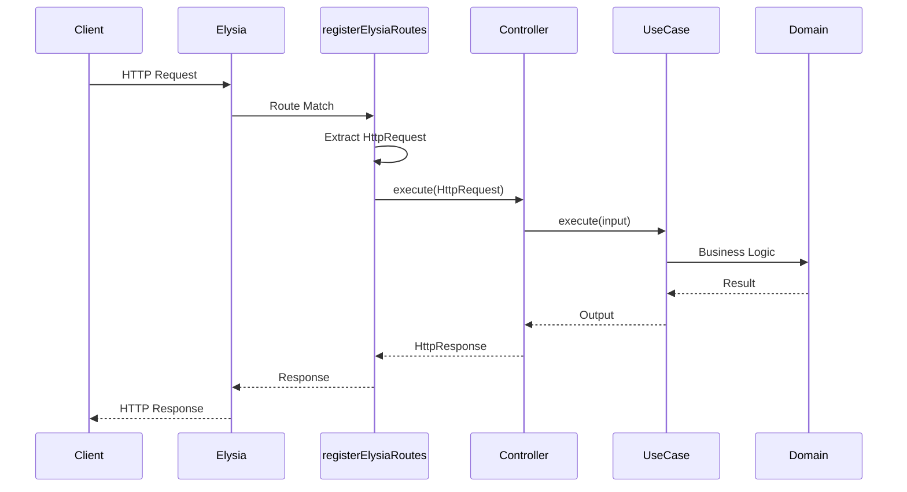
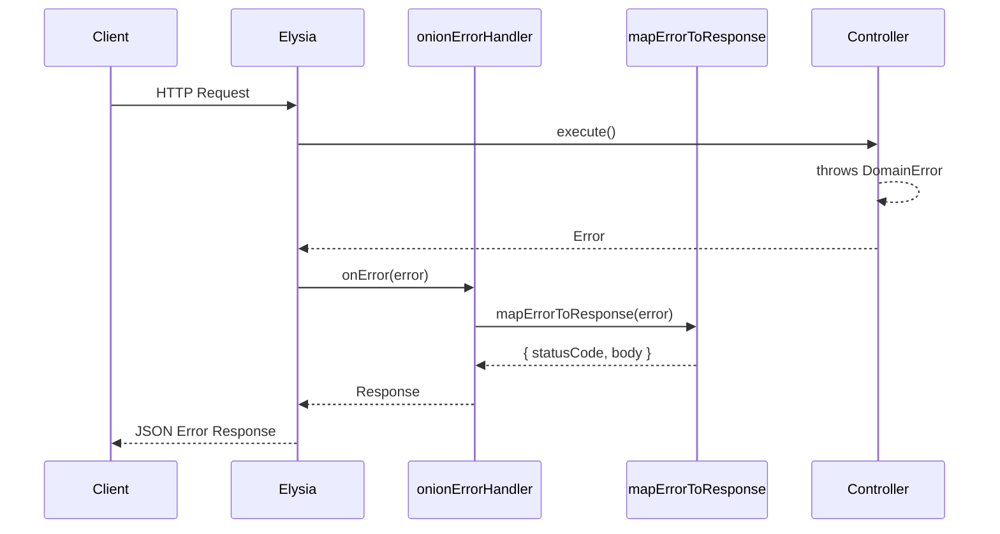
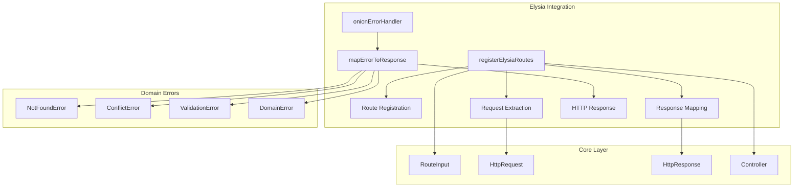
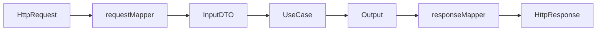
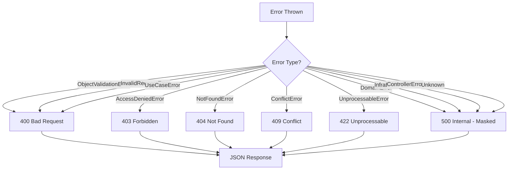

# Elysia Framework Integration

> Seamless integration between onion-lasagna architecture and [Elysia](https://elysiajs.com/) - the ergonomic, high-performance web framework for Bun.

---

## Table of Contents

- [Overview](#overview)
- [Architecture](#architecture)
- [Installation](#installation)
- [Quick Start](#quick-start)
- [API Reference](#api-reference)
- [Controller Pattern](#controller-pattern)
- [Error Handling](#error-handling)
- [Complete Example](#complete-example)
- [Deployment](#deployment)
- [Comparison](#comparison)

---

## Overview

This integration bridges the onion-lasagna clean architecture with Elysia's powerful routing system, providing:

| Feature                            | Description                                                 |
| ---------------------------------- | ----------------------------------------------------------- |
| **Flexible Route Registration**    | Register a single route or an array of routes in one call   |
| **Route Prefixing**                | Apply prefixes to route groups for API versioning           |
| **Automatic Path Conversion**      | Converts `{param}` syntax to Elysia's `:param` format       |
| **Error Mapping**                  | Maps domain errors to appropriate HTTP responses            |
| **Framework Agnostic Controllers** | Use the same controller pattern across different frameworks |

---

## Architecture

### Request Flow



### Error Handling Flow



### Module Structure



---

## Installation

Ensure `elysia` is installed in your project:

```bash
# Using bun (recommended for Elysia)
bun add elysia

# Using pnpm
pnpm add elysia

# Using npm
npm install elysia
```

---

## Quick Start

```typescript
import { Elysia } from 'elysia';
import {
  registerElysiaRoutes,
  onionErrorHandler,
} from '@cosmneo/onion-lasagna/backend/frameworks/elysia';

const app = new Elysia()
  // 1. Apply error handler
  .onError(onionErrorHandler);

// 2. Register routes (array)
registerElysiaRoutes(app, [
  { metadata: { path: '/users', method: 'POST' }, controller: createUserController },
  { metadata: { path: '/users/{id}', method: 'GET' }, controller: getUserController },
  { metadata: { path: '/users/{id}', method: 'PUT' }, controller: updateUserController },
  { metadata: { path: '/users/{id}', method: 'DELETE' }, controller: deleteUserController },
]);

// 3. Or register a single route
registerElysiaRoutes(app, {
  metadata: { path: '/health', method: 'GET' },
  controller: healthController,
});

export default app;
```

---

## API Reference

### `registerElysiaRoutes(app, routes, options?)`

Registers routes onto an Elysia app. Accepts either a single route or an array of routes.

```typescript
function registerElysiaRoutes(
  app: Elysia,
  routes: RouteInput<HttpController> | RouteInput<HttpController>[],
  options?: RegisterRoutesOptions,
): void;

interface RegisterRoutesOptions {
  prefix?: string;
}
```

| Parameter         | Type                | Description                                   |
| ----------------- | ------------------- | --------------------------------------------- |
| `app`             | `Elysia`            | The Elysia app instance (passed by reference) |
| `routes`          | `RouteInputOrArray` | A single route or an array of routes          |
| `options?.prefix` | `string`            | Prefix to apply to all routes                 |

#### Path Conversion

The function automatically converts onion-lasagna path syntax to Elysia format:

| Input                              | Output                           |
| ---------------------------------- | -------------------------------- |
| `/users/{id}`                      | `/users/:id`                     |
| `/orders/{orderId}/items/{itemId}` | `/orders/:orderId/items/:itemId` |

#### Examples

**Single route:**

```typescript
registerElysiaRoutes(app, {
  metadata: { path: '/health', method: 'GET' },
  controller: healthController,
});
```

**Array of routes:**

```typescript
registerElysiaRoutes(app, [
  { metadata: { path: '/users', method: 'POST' }, controller: createUserController },
  { metadata: { path: '/users/{id}', method: 'GET' }, controller: getUserController },
]);
```

**With prefix:**

```typescript
registerElysiaRoutes(app, userRoutes, { prefix: '/api/v1' });
// Routes will be: /api/v1/users, /api/v1/users/:id, etc.
```

---

### `onionErrorHandler(context)`

Error handler that maps domain errors to HTTP responses.

```typescript
function onionErrorHandler({ error }: { error: unknown }): Response;
```

**Usage:**

```typescript
const app = new Elysia().onError(onionErrorHandler);
```

---

### `mapErrorToResponse(error)`

Converts domain/use-case errors to HTTP status codes and response bodies.

```typescript
function mapErrorToResponse(error: unknown): MappedErrorResponse;

interface MappedErrorResponse {
  statusCode: number;
  body: ErrorResponseBody;
}

interface ErrorResponseBody {
  message: string;
  errorCode: string;
  errorItems?: Array<{ item: string; message: string }>;
}
```

---

### `HttpController`

Type alias for controllers that work with HTTP request/response:

```typescript
type HttpController = Controller<HttpRequest, HttpResponse>;
```

---

## Controller Pattern

### Basic Controller

```typescript
import type { HttpController } from '@cosmneo/onion-lasagna/backend/frameworks/elysia';

const getUserController: HttpController = {
  async execute(request) {
    const userId = request.pathParams?.id as string;
    const user = await getUserUseCase.execute({ id: userId });

    return {
      statusCode: 200,
      body: user,
    };
  },
};
```

### Using BaseController

For a more structured approach with request mapping and validation:

```typescript
import { BaseController } from '@cosmneo/onion-lasagna/backend/core/presentation';

const createUserController = BaseController.create({
  requestMapper: (request) => CreateUserInputDto.create(request.body),
  useCase: createUserUseCase,
  responseMapper: (output) => ({
    statusCode: 201,
    body: { id: output.value.id },
  }),
});
```

### Controller Flow



---

## Error Handling

### Error Mapping Table

| Error Type              | HTTP Status | Masked  | Description                |
| ----------------------- | :---------: | :-----: | -------------------------- |
| `ObjectValidationError` |    `400`    |   No    | Schema validation failed   |
| `InvalidRequestError`   |    `400`    |   No    | Request validation failed  |
| `AccessDeniedError`     |    `403`    |   No    | Authorization failed       |
| `NotFoundError`         |    `404`    |   No    | Resource not found         |
| `ConflictError`         |    `409`    |   No    | Resource conflict          |
| `UnprocessableError`    |    `422`    |   No    | Business rule violation    |
| `UseCaseError`          |    `400`    |   No    | Use case failure           |
| `DomainError`           |    `500`    | **Yes** | Domain invariant violation |
| `InfraError`            |    `500`    | **Yes** | Infrastructure failure     |
| `ControllerError`       |    `500`    | **Yes** | Controller failure         |
| Unknown                 |    `500`    | **Yes** | Unexpected error           |

> **Security Note:** Internal errors (Domain, Infra, Controller) are masked to prevent leaking implementation details. The response shows "An unexpected error occurred" while the original error is preserved for logging.

### Error Response Format

```json
{
  "message": "User not found",
  "errorCode": "USER_NOT_FOUND",
  "errorItems": [{ "item": "email", "message": "Invalid email format" }]
}
```

### Error Flow Diagram



---

## Complete Example

### Project Structure

```
src/
├── domains/
│   └── user/
│       ├── controllers/
│       │   ├── create-user.controller.ts
│       │   ├── get-user.controller.ts
│       │   └── index.ts
│       ├── routes.ts
│       └── use-cases/
│           └── ...
├── app.ts
└── server.ts
```

### Define Routes

```typescript
// domains/user/routes.ts
import type { RouteInput } from '@cosmneo/onion-lasagna/backend/core/presentation';
import type { HttpController } from '@cosmneo/onion-lasagna/backend/frameworks/elysia';
import {
  createUserController,
  getUserController,
  updateUserController,
  deleteUserController,
} from './controllers';

export const userRoutes: RouteInput<HttpController>[] = [
  {
    metadata: { path: '/users', method: 'POST' },
    controller: createUserController,
  },
  {
    metadata: { path: '/users', method: 'GET' },
    controller: listUsersController,
  },
  {
    metadata: { path: '/users/{id}', method: 'GET' },
    controller: getUserController,
  },
  {
    metadata: { path: '/users/{id}', method: 'PUT' },
    controller: updateUserController,
  },
  {
    metadata: { path: '/users/{id}', method: 'DELETE' },
    controller: deleteUserController,
  },
];
```

### Create Controller

```typescript
// domains/user/controllers/get-user.controller.ts
import { BaseController } from '@cosmneo/onion-lasagna/backend/core/presentation';
import { NotFoundError } from '@cosmneo/onion-lasagna/backend/core/onion-layers';
import { getUserUseCase } from '../use-cases';

export const getUserController = BaseController.create({
  requestMapper: (request) => ({
    id: request.pathParams?.id as string,
  }),

  useCase: getUserUseCase,

  responseMapper: (output) => {
    if (!output.value) {
      throw new NotFoundError({
        message: 'User not found',
        code: 'USER_NOT_FOUND',
      });
    }

    return {
      statusCode: 200,
      body: output.value,
    };
  },
});
```

### Bootstrap Application

```typescript
// app.ts
import { Elysia } from 'elysia';
import { cors } from '@elysiajs/cors';
import {
  registerElysiaRoutes,
  onionErrorHandler,
} from '@cosmneo/onion-lasagna/backend/frameworks/elysia';

// Import routes from domains
import { userRoutes } from './domains/user/routes';
import { orderRoutes } from './domains/order/routes';
import { productRoutes } from './domains/product/routes';

const app = new Elysia()
  // ─────────────────────────────────────────────────────────────
  // Plugins & Middleware
  // ─────────────────────────────────────────────────────────────
  .use(cors())

  // ─────────────────────────────────────────────────────────────
  // Error Handling
  // ─────────────────────────────────────────────────────────────
  .onError(onionErrorHandler)

  // ─────────────────────────────────────────────────────────────
  // Health Check
  // ─────────────────────────────────────────────────────────────
  .get('/health', () => ({ status: 'ok', timestamp: new Date().toISOString() }));

// ─────────────────────────────────────────────────────────────
// Routes
// ─────────────────────────────────────────────────────────────
registerElysiaRoutes(app, userRoutes, { prefix: '/api' });
registerElysiaRoutes(app, orderRoutes, { prefix: '/api' });
registerElysiaRoutes(app, productRoutes, { prefix: '/api' });

export default app;
```

### Start Server

```typescript
// server.ts
import app from './app';

app.listen(3000);

console.log(`🦊 Elysia server running at http://localhost:${app.server?.port}`);
```

---

## Deployment

### Bun (Recommended)

```typescript
// server.ts
import app from './app';

app.listen(3000);

console.log(`Server running at http://localhost:${app.server?.port}`);
```

```bash
bun run server.ts
```

### Docker

```dockerfile
FROM oven/bun:1

WORKDIR /app
COPY package.json bun.lockb ./
RUN bun install --frozen-lockfile

COPY . .
CMD ["bun", "run", "server.ts"]
```

---

## Request & Response Types

### HttpRequest

```typescript
interface HttpRequest {
  /** Parsed JSON body */
  body?: unknown;

  /** Request headers (lowercase keys) */
  headers?: Record<string, unknown>;

  /** Query string parameters */
  queryParams?: Record<string, unknown>;

  /** Path parameters from route */
  pathParams?: Record<string, unknown>;
}
```

### HttpResponse

```typescript
interface HttpResponse {
  /** HTTP status code */
  statusCode: number;

  /** Response headers */
  headers?: Record<string, unknown>;

  /** Response body (auto-serialized to JSON) */
  body?: unknown;
}
```

---

## Comparison

### Elysia Integration vs Hono Integration

| Feature            | Elysia Integration | Hono Integration  |
| ------------------ | :----------------: | :---------------: |
| **Runtime**        |   Bun-optimized    |   Multi-runtime   |
| **Route Prefix**   |  Built-in option   |      Manual       |
| **Middlewares**    | Via Elysia plugins | Via options param |
| **Error Handling** |  `app.onError()`   |  `app.onError()`  |
| **Type Safety**    |        Full        |       Full        |
| **Performance**    |  Excellent (Bun)   |     Excellent     |

> **Recommendation:** Use Elysia if you're building with Bun for the best performance. Use Hono if you need multi-runtime support (Node.js, Deno, Cloudflare Workers, etc.).

---

## License

MIT
