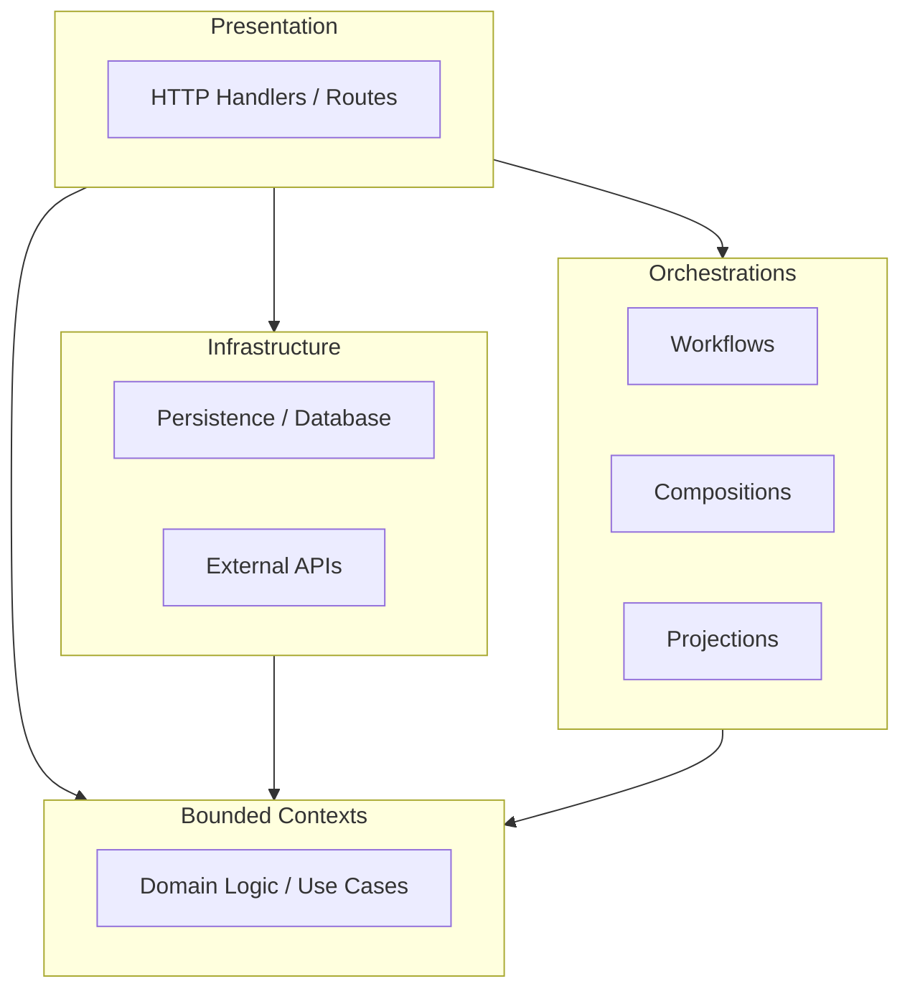
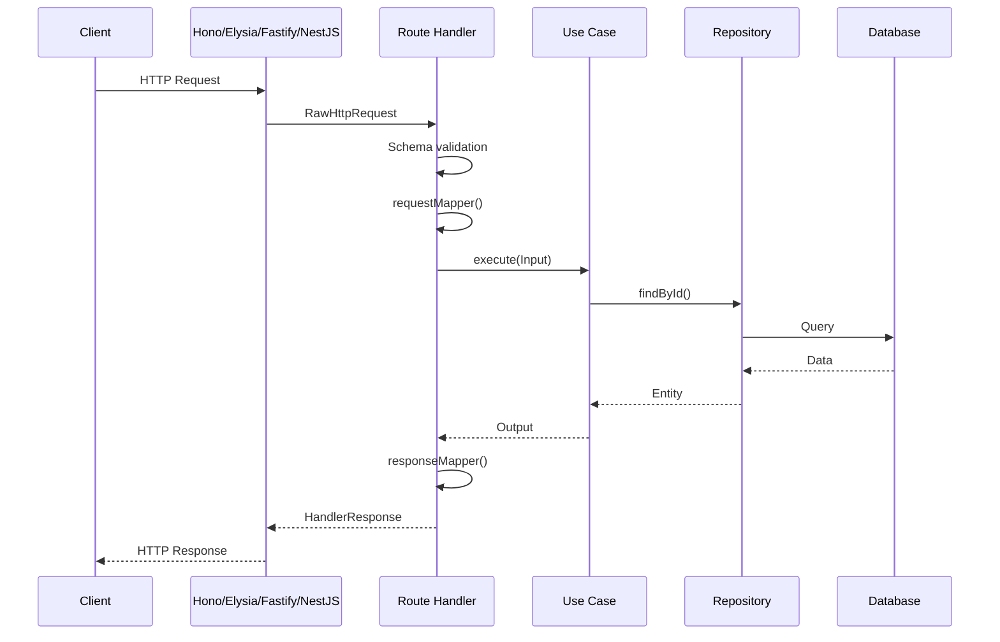
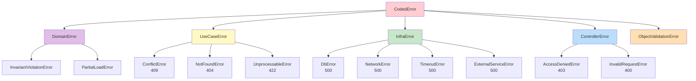

# Onion Lasagna

Enterprise-grade TypeScript library for building backend applications with hexagonal/onion architecture.

[](https://onion-lasagna.vercel.app)

---

## Features

- **Hexagonal Architecture** - Clean separation between domain, application, infrastructure, and presentation layers
- **Framework Agnostic** - Works with Hono, Elysia, Fastify, and NestJS
- **Unified HTTP Layer** - Route definitions as single source of truth for server, client, and OpenAPI
- **Schema Adapters** - Choose between Zod or TypeBox for validation
- **Zero Dependencies** - Everything is peer dependencies, install only what you use
- **DDD Building Blocks** - Entity, Value Object, Aggregate Root, Domain Event base classes
- **Error Handling** - Layered error hierarchy with automatic wrapping and HTTP mapping

---

## Architecture



### Request Flow



---

## Error Hierarchy



---

## Installation

```bash
bun add @cosmneo/onion-lasagna
```

Install peer dependencies based on your choices:

```bash
# Schema validation (pick one)
bun add zod           # or @sinclair/typebox

# Framework (pick one)
bun add hono          # or elysia, fastify, @nestjs/common @nestjs/core

# Required utilities
bun add uuid
```

---

## Quick Start

### 1. Define a Value Object

```typescript
import { BaseUuidV7Vo } from '@cosmneo/onion-lasagna/backend/core/onion-layers';
import { v7 } from 'uuid';

export class ProjectId extends BaseUuidV7Vo {
  static override generate(): ProjectId {
    return new ProjectId(v7());
  }

  static override create(value: string): ProjectId {
    const validated = BaseUuidV7Vo.create(value);
    return new ProjectId(validated.value);
  }
}
```

### 2. Define an Aggregate

```typescript
import { BaseAggregateRoot } from '@cosmneo/onion-lasagna/backend/core/onion-layers';
import { ProjectId, ProjectName } from './value-objects';

interface ProjectProps {
  name: ProjectName;
  description?: string;
}

export class Project extends BaseAggregateRoot<ProjectId, ProjectProps> {
  static create(name: ProjectName, description?: string): Project {
    return new Project(ProjectId.generate(), { name, description });
  }

  get name(): string {
    return this._props.name.value;
  }

  rename(newName: ProjectName): void {
    this._props.name = newName;
  }
}
```

### 3. Define a Use Case

```typescript
import {
  BaseInboundAdapter,
  NotFoundError,
} from '@cosmneo/onion-lasagna/backend/core/onion-layers';

interface CreateProjectInput {
  name: string;
  description?: string;
}

interface CreateProjectOutput {
  projectId: string;
}

export class CreateProjectUseCase extends BaseInboundAdapter<
  CreateProjectInput,
  CreateProjectOutput
> {
  constructor(private projectRepository: ProjectRepositoryPort) {
    super();
  }

  protected async handle(input: CreateProjectInput): Promise<CreateProjectOutput> {
    const name = ProjectName.create(input.name);
    const project = Project.create(name, input.description);

    await this.projectRepository.save(project);

    return { projectId: project.id.value };
  }
}
```

### 4. Define Routes (Contract)

```typescript
import { defineRoute } from '@cosmneo/onion-lasagna/http/route';
import { zodSchema, z } from '@cosmneo/onion-lasagna/http/schema/zod';

export const createProjectRoute = defineRoute({
  method: 'POST',
  path: '/api/projects',
  request: {
    body: {
      schema: zodSchema(
        z.object({
          name: z.string().min(1),
          description: z.string().optional(),
        }),
      ),
    },
  },
  responses: {
    201: {
      description: 'Project created',
      schema: zodSchema(z.object({ projectId: z.string() })),
    },
  },
});
```

### 5. Define Router

```typescript
import { defineRouter } from '@cosmneo/onion-lasagna/http/route';
import { createProjectRoute, listProjectsRoute, getProjectRoute } from './routes';

export const projectRouter = defineRouter({
  projects: {
    create: createProjectRoute,
    list: listProjectsRoute,
    get: getProjectRoute,
  },
});
```

### 6. Create Handlers

```typescript
import { serverRoutes } from '@cosmneo/onion-lasagna/http/server';
import { projectRouter } from './router';

export function createProjectHandlers(useCases: UseCases) {
  return serverRoutes(projectRouter)
    .handle('projects.create', {
      requestMapper: (req, ctx) => ({
        name: req.body.name,
        description: req.body.description,
      }),
      useCase: useCases.createProjectUseCase,
      responseMapper: (output) => ({
        status: 201 as const,
        body: { projectId: output.projectId },
      }),
    })
    .handle('projects.list', {
      requestMapper: (req) => ({
        page: req.query?.page ?? 1,
        pageSize: req.query?.pageSize ?? 20,
      }),
      useCase: useCases.listProjectsUseCase,
      responseMapper: (output) => ({
        status: 200 as const,
        body: output,
      }),
    })
    .build();
}
```

### 7. Wire Up with Framework

**Hono:**

```typescript
import { Hono } from 'hono';
import { registerHonoRoutes, onionErrorHandler } from '@cosmneo/onion-lasagna/http/frameworks/hono';

const app = new Hono();
app.onError(onionErrorHandler);

const routes = createProjectHandlers(useCases);
registerHonoRoutes(app, routes);

export default app;
```

**Elysia:**

```typescript
import { Elysia } from 'elysia';
import {
  registerElysiaRoutes,
  onionErrorHandler,
} from '@cosmneo/onion-lasagna/http/frameworks/elysia';

const app = new Elysia();
app.onError(onionErrorHandler);

const routes = createProjectHandlers(useCases);
registerElysiaRoutes(app, routes);

export default app;
```

**Fastify:**

```typescript
import Fastify from 'fastify';
import {
  registerFastifyRoutes,
  onionErrorHandler,
} from '@cosmneo/onion-lasagna/http/frameworks/fastify';

const app = Fastify();
app.setErrorHandler(onionErrorHandler);

const routes = createProjectHandlers(useCases);
registerFastifyRoutes(app, routes);

export default app;
```

---

## Package Exports

| Path                         | Purpose                               |
| ---------------------------- | ------------------------------------- |
| `/backend/core/onion-layers` | Domain, App, Infra layer base classes |
| `/backend/core/global`       | CodedError, ObjectValidationError     |
| `/backend/core/presentation` | Presentation layer errors             |
| `/http`                      | HTTP types and utilities              |
| `/http/route`                | `defineRoute`, `defineRouter`         |
| `/http/server`               | `serverRoutes`, route handlers        |
| `/http/schema/zod`           | Zod schema adapter                    |
| `/http/schema/typebox`       | TypeBox schema adapter                |
| `/http/openapi`              | OpenAPI spec generation               |
| `/http/frameworks/hono`      | Hono integration                      |
| `/http/frameworks/elysia`    | Elysia integration                    |
| `/http/frameworks/fastify`   | Fastify integration                   |
| `/http/frameworks/nestjs`    | NestJS integration                    |

---

## Error Handling

Layered error hierarchy with automatic HTTP status mapping:

| Error Type              | HTTP Status | Use Case                         |
| ----------------------- | ----------- | -------------------------------- |
| `ObjectValidationError` | 400         | Schema validation                |
| `InvalidRequestError`   | 400         | Bad request data                 |
| `AccessDeniedError`     | 403         | Authorization failures           |
| `NotFoundError`         | 404         | Resource not found               |
| `ConflictError`         | 409         | Duplicate resources              |
| `UnprocessableError`    | 422         | Business rule violations         |
| `DomainError`           | 500         | Domain invariants (masked)       |
| `InfraError`            | 500         | Infrastructure failures (masked) |

---

## Built-in Value Objects

| Class              | Purpose                       |
| ------------------ | ----------------------------- |
| `BaseUuidV4Vo`     | UUID v4 value object          |
| `BaseUuidV7Vo`     | UUID v7 value object          |
| `BaseEmailVo`      | Email validation              |
| `BaseShortTextVo`  | Short text (1-100 chars)      |
| `BaseMediumTextVo` | Medium text (1-500 chars)     |
| `BaseLongTextVo`   | Long text (1-5000 chars)      |
| `BasePaginationVo` | Pagination (page, pageSize)   |
| `BaseAuditByVo`    | Audit trail (createdBy, etc.) |
| `BaseAuditOnVo`    | Timestamps (createdAt, etc.)  |

---

## Documentation

Full documentation with guides, API reference, and examples:

**[onion-lasagna.vercel.app](https://onion-lasagna.vercel.app)**

---

## License

Proprietary - Cosmneo Organization
