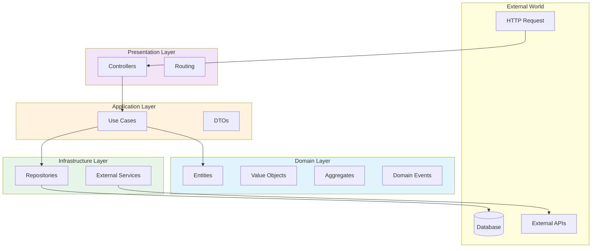
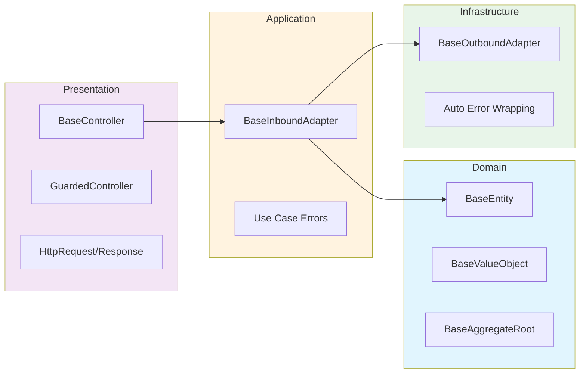
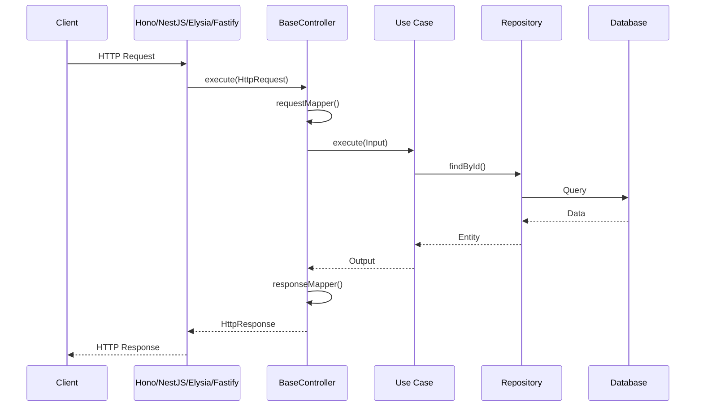
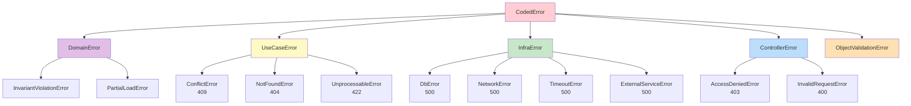
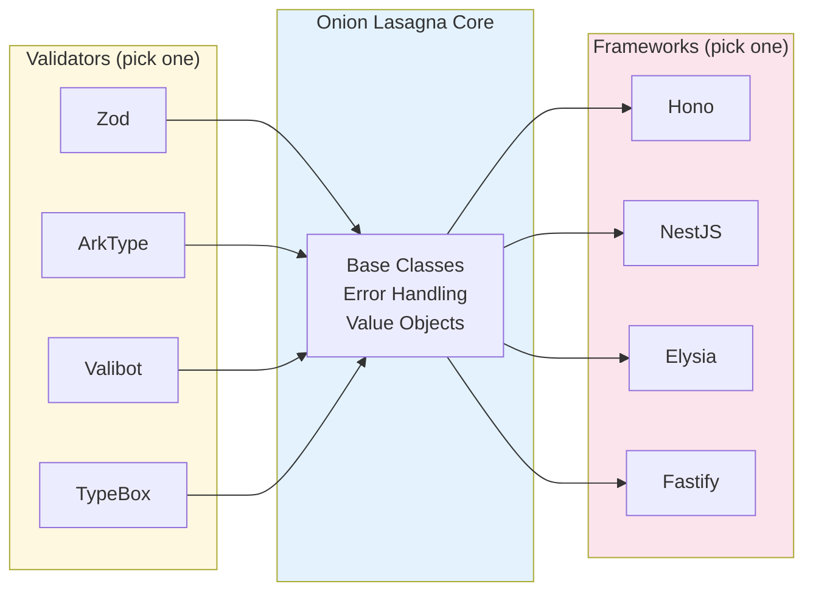

# Onion Lasagna

Enterprise-grade TypeScript library for building backend applications with hexagonal/onion architecture.

[](https://onion-lasagna.cosmneo.com)

> Comprehensive documentation available at **[onion-lasagna.cosmneo.com](https://onion-lasagna.cosmneo.com)**

---

## Features

- **Hexagonal Architecture** - Clean separation between domain, application, infrastructure, and presentation layers
- **Framework Agnostic** - Works with Hono, NestJS, Elysia, and Fastify
- **Validator Agnostic** - Choose between Zod, ArkType, Valibot, or TypeBox
- **Type Safe** - Full TypeScript with strict mode, generics throughout
- **Zero Dependencies** - Everything is peer dependencies, install only what you use
- **DDD Building Blocks** - Entity, Value Object, Aggregate Root, Domain Event base classes
- **Error Handling** - Layered error hierarchy with automatic wrapping and mapping

---

## Architecture



### Layer Responsibilities



---

## Request Flow



---

## Error Hierarchy



---

## Pick Your Stack



---

## Installation

```bash
bun add @cosmneo/onion-lasagna
```

Install peer dependencies based on your choices:

```bash
# Validator (pick one)
bun add zod           # or arktype, valibot, @sinclair/typebox

# Framework (pick one)
bun add hono          # or @nestjs/common @nestjs/core, elysia, fastify

# Required utilities
bun add uuid http-status-codes
```

---

## Quick Start

### 1. Define a Value Object

```typescript
import {
  BaseUUIDv7,
  SKIP_VALUE_OBJECT_VALIDATION,
} from '@cosmneo/onion-lasagna/backend/core/onion-layers';
import { createZodValidator } from '@cosmneo/onion-lasagna/backend/core/validators/zod';
import { z } from 'zod';
import { v7 as uuidv7 } from 'uuid';

const userIdSchema = z.string().uuid();

export class UserId extends BaseUUIDv7 {
  static generate(): UserId {
    return new UserId(uuidv7(), SKIP_VALUE_OBJECT_VALIDATION);
  }

  static create(value: string): UserId {
    return new UserId(value, createZodValidator(userIdSchema));
  }
}
```

### 2. Define an Entity

```typescript
import { BaseEntity } from '@cosmneo/onion-lasagna/backend/core/onion-layers';

interface UserProps {
  email: string;
  name: string;
}

export class User extends BaseEntity<UserId, UserProps> {
  static create(id: UserId, email: string, name: string): User {
    return new User(id, { email, name });
  }

  get email(): string {
    return this.props.email;
  }

  get name(): string {
    return this.props.name;
  }

  changeName(newName: string): void {
    this._props.name = newName;
  }
}
```

### 3. Define a Use Case

```typescript
import {
  BaseInboundAdapter,
  NotFoundError,
} from '@cosmneo/onion-lasagna/backend/core/onion-layers';

interface GetUserInput {
  userId: string;
}

interface GetUserOutput {
  user: User;
}

export class GetUserUseCase extends BaseInboundAdapter<GetUserInput, GetUserOutput> {
  constructor(private userRepository: UserRepository) {
    super();
  }

  protected async handle(input: GetUserInput): Promise<GetUserOutput> {
    const user = await this.userRepository.findById(UserId.create(input.userId));

    if (!user) {
      throw new NotFoundError({ message: 'User not found' });
    }

    return { user };
  }
}
```

### 4. Define a Controller

```typescript
import { BaseController, HttpResponse } from '@cosmneo/onion-lasagna/backend/core/onion-layers';
import type { HttpRequest } from '@cosmneo/onion-lasagna/backend/core/presentation';

export class GetUserController extends BaseController<GetUserInput, GetUserOutput, UserDto> {
  constructor(private getUserUseCase: GetUserUseCase) {
    super();
  }

  protected requestMapper(req: HttpRequest): GetUserInput {
    return { userId: req.pathParams.id };
  }

  protected get useCase() {
    return this.getUserUseCase;
  }

  protected responseMapper(output: GetUserOutput): HttpResponse<UserDto> {
    return HttpResponse.ok({
      id: output.user.id.value,
      email: output.user.email,
      name: output.user.name,
    });
  }
}
```

### 5. Wire Up with Your Framework

**Hono:**

```typescript
import { Hono } from 'hono';
import {
  registerHonoRoutes,
  onionErrorHandler,
} from '@cosmneo/onion-lasagna/backend/frameworks/hono';

const app = new Hono();
app.onError(onionErrorHandler);

registerHonoRoutes(app, [
  {
    method: 'GET',
    path: '/users/{id}',
    controller: new GetUserController(getUserUseCase),
  },
]);
```

**NestJS:**

```typescript
import { Controller, Get } from '@nestjs/common';
import {
  BaseNestController,
  OnionLasagnaRequest,
} from '@cosmneo/onion-lasagna/backend/frameworks/nestjs';

@Controller('users')
export class UserController extends BaseNestController {
  constructor(private getUserController: GetUserController) {
    super();
  }

  @Get(':id')
  getUser(@OnionLasagnaRequest() req: HttpRequest) {
    return this.getUserController.execute(req);
  }
}
```

---

## Package Exports

| Path                               | Purpose                                       |
| ---------------------------------- | --------------------------------------------- |
| `/backend/core/onion-layers`       | Domain, App, Infra, Presentation base classes |
| `/backend/core/global`             | BaseDto, CodedError, utilities                |
| `/backend/core/presentation`       | HTTP types, routing                           |
| `/backend/core/validators/zod`     | Zod validation                                |
| `/backend/core/validators/arktype` | ArkType validation                            |
| `/backend/core/validators/valibot` | Valibot validation                            |
| `/backend/core/validators/typebox` | TypeBox validation                            |
| `/backend/frameworks/hono`         | Hono integration                              |
| `/backend/frameworks/nestjs`       | NestJS integration                            |
| `/backend/frameworks/elysia`       | Elysia integration                            |
| `/backend/frameworks/fastify`      | Fastify integration                           |

---

## Error Handling

Layered error hierarchy with automatic HTTP status mapping:

| Error Type            | HTTP Status | Use Case                 |
| --------------------- | ----------- | ------------------------ |
| `InvalidRequestError` | 400         | Validation failures      |
| `AccessDeniedError`   | 403         | Authorization failures   |
| `NotFoundError`       | 404         | Resource not found       |
| `ConflictError`       | 409         | Duplicate resources      |
| `UnprocessableError`  | 422         | Business rule violations |
| `InfraError`          | 500         | Infrastructure failures  |

---

## Documentation

Full documentation with guides, API reference, and examples:

**[onion-lasagna.cosmneo.com](https://onion-lasagna.cosmneo.com)**

---

## License

MIT
