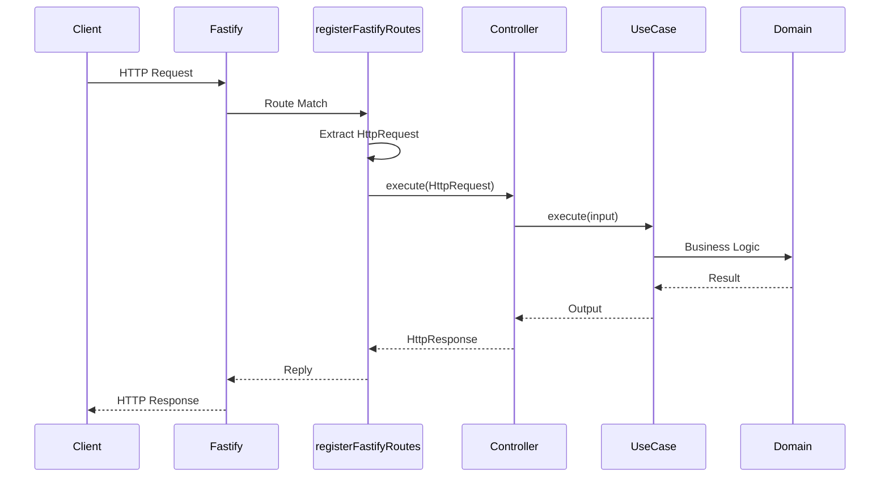
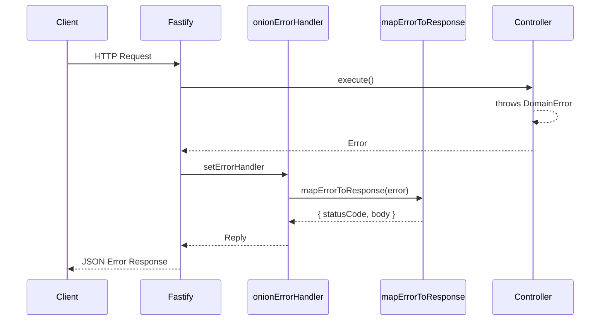
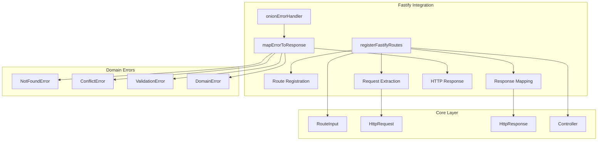
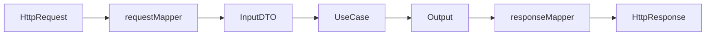
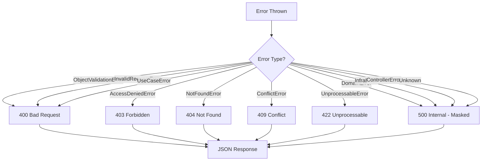

# Fastify Framework Integration

> Seamless integration between onion-lasagna architecture and [Fastify](https://fastify.dev/) - the fast and low overhead web framework for Node.js.

---

## Table of Contents

- [Overview](#overview)
- [Architecture](#architecture)
- [Installation](#installation)
- [Quick Start](#quick-start)
- [API Reference](#api-reference)
- [Controller Pattern](#controller-pattern)
- [Error Handling](#error-handling)
- [Hooks & Plugins](#hooks--plugins)
- [Complete Example](#complete-example)
- [Deployment](#deployment)
- [Comparison](#comparison)

---

## Overview

This integration bridges the onion-lasagna clean architecture with Fastify's powerful routing and plugin system, providing:

| Feature                            | Description                                                 |
| ---------------------------------- | ----------------------------------------------------------- |
| **Flexible Route Registration**    | Register a single route or an array of routes in one call   |
| **Route Prefixing**                | Apply prefixes to route groups for API versioning           |
| **Automatic Path Conversion**      | Converts `{param}` syntax to Fastify's `:param` format      |
| **Error Mapping**                  | Maps domain errors to appropriate HTTP responses            |
| **Framework Agnostic Controllers** | Use the same controller pattern across different frameworks |
| **Plugin Compatible**              | Works seamlessly with Fastify's plugin ecosystem            |

---

## Architecture

### Request Flow



### Error Handling Flow



### Module Structure



---

## Installation

Ensure `fastify` is installed in your project:

```bash
# Using bun
bun add fastify

# Using pnpm
pnpm add fastify

# Using npm
npm install fastify
```

---

## Quick Start

```typescript
import Fastify from 'fastify';
import {
  registerFastifyRoutes,
  onionErrorHandler,
} from '@cosmneo/onion-lasagna/backend/frameworks/fastify';

const app = Fastify({ logger: true });

// 1. Apply error handler
app.setErrorHandler(onionErrorHandler);

// 2. Register routes (array)
registerFastifyRoutes(app, [
  { metadata: { servicePath: '/users', method: 'POST' }, controller: createUserController },
  { metadata: { servicePath: '/users/{id}', method: 'GET' }, controller: getUserController },
  { metadata: { servicePath: '/users/{id}', method: 'PUT' }, controller: updateUserController },
  { metadata: { servicePath: '/users/{id}', method: 'DELETE' }, controller: deleteUserController },
]);

// 3. Or register a single route
registerFastifyRoutes(app, {
  metadata: { servicePath: '/health', method: 'GET' },
  controller: healthController,
});

// 4. Start server
await app.listen({ port: 3000 });
```

---

## API Reference

### `registerFastifyRoutes(app, routes, options?)`

Registers routes onto a Fastify instance. Accepts either a single route or an array of routes.

```typescript
function registerFastifyRoutes(
  app: FastifyInstance,
  routes: RouteInput<HttpController> | RouteInput<HttpController>[],
  options?: RegisterRoutesOptions,
): void;

interface RegisterRoutesOptions {
  prefix?: string;
}
```

| Parameter         | Type                | Description                                |
| ----------------- | ------------------- | ------------------------------------------ |
| `app`             | `FastifyInstance`   | The Fastify instance (passed by reference) |
| `routes`          | `RouteInputOrArray` | A single route or an array of routes       |
| `options?.prefix` | `string`            | Prefix to apply to all routes              |

#### Path Conversion

The function automatically converts onion-lasagna path syntax to Fastify format:

| Input                              | Output                           |
| ---------------------------------- | -------------------------------- |
| `/users/{id}`                      | `/users/:id`                     |
| `/orders/{orderId}/items/{itemId}` | `/orders/:orderId/items/:itemId` |

#### Examples

**Single route:**

```typescript
registerFastifyRoutes(app, {
  metadata: { servicePath: '/health', method: 'GET' },
  controller: healthController,
});
```

**Array of routes:**

```typescript
registerFastifyRoutes(app, [
  { metadata: { servicePath: '/users', method: 'POST' }, controller: createUserController },
  { metadata: { servicePath: '/users/{id}', method: 'GET' }, controller: getUserController },
]);
```

**With prefix:**

```typescript
registerFastifyRoutes(app, userRoutes, { prefix: '/api/v1' });
// Routes will be: /api/v1/users, /api/v1/users/:id, etc.
```

---

### `onionErrorHandler(error, request, reply)`

Error handler that maps domain errors to HTTP responses.

```typescript
function onionErrorHandler(
  error: FastifyError | Error,
  request: FastifyRequest,
  reply: FastifyReply,
): FastifyReply;
```

**Usage:**

```typescript
app.setErrorHandler(onionErrorHandler);
```

---

### `mapErrorToResponse(error)`

Converts domain/use-case errors to HTTP status codes and response bodies.

```typescript
function mapErrorToResponse(error: unknown): MappedErrorResponse;

interface MappedErrorResponse {
  statusCode: number;
  body: ErrorResponseBody;
}

interface ErrorResponseBody {
  message: string;
  errorCode: string;
  errorItems?: Array<{ item: string; message: string }>;
}
```

---

### `HttpController`

Type alias for controllers that work with HTTP request/response:

```typescript
type HttpController = Controller<HttpRequest, HttpResponse>;
```

---

## Controller Pattern

### Basic Controller

```typescript
import type { HttpController } from '@cosmneo/onion-lasagna/backend/frameworks/fastify';

const getUserController: HttpController = {
  async execute(request) {
    const userId = request.pathParams?.id as string;
    const user = await getUserUseCase.execute({ id: userId });

    return {
      statusCode: 200,
      body: user,
    };
  },
};
```

### Using BaseController

For a more structured approach with request mapping and validation:

```typescript
import { BaseController } from '@cosmneo/onion-lasagna/backend/core/presentation';

const createUserController = BaseController.create({
  requestMapper: (request) => CreateUserInputDto.create(request.body),
  useCase: createUserUseCase,
  responseMapper: (output) => ({
    statusCode: 201,
    body: { id: output.value.id },
  }),
});
```

### Controller Flow



---

## Error Handling

### Error Mapping Table

| Error Type              | HTTP Status | Masked  | Description                |
| ----------------------- | :---------: | :-----: | -------------------------- |
| `ObjectValidationError` |    `400`    |   No    | Schema validation failed   |
| `InvalidRequestError`   |    `400`    |   No    | Request validation failed  |
| `AccessDeniedError`     |    `403`    |   No    | Authorization failed       |
| `NotFoundError`         |    `404`    |   No    | Resource not found         |
| `ConflictError`         |    `409`    |   No    | Resource conflict          |
| `UnprocessableError`    |    `422`    |   No    | Business rule violation    |
| `UseCaseError`          |    `400`    |   No    | Use case failure           |
| `DomainError`           |    `500`    | **Yes** | Domain invariant violation |
| `InfraError`            |    `500`    | **Yes** | Infrastructure failure     |
| `ControllerError`       |    `500`    | **Yes** | Controller failure         |
| Unknown                 |    `500`    | **Yes** | Unexpected error           |

> **Security Note:** Internal errors (Domain, Infra, Controller) are masked to prevent leaking implementation details. The response shows "An unexpected error occurred" while the original error is logged.

### Error Response Format

```json
{
  "message": "User not found",
  "errorCode": "USER_NOT_FOUND",
  "errorItems": [{ "item": "email", "message": "Invalid email format" }]
}
```

### Error Flow Diagram



---

## Hooks & Plugins

Fastify's hooks and plugins work seamlessly with the onion integration.

### Using Hooks

```typescript
import Fastify from 'fastify';
import {
  registerFastifyRoutes,
  onionErrorHandler,
} from '@cosmneo/onion-lasagna/backend/frameworks/fastify';

const app = Fastify({ logger: true });

// Pre-handler hook for authentication
app.addHook('preHandler', async (request, reply) => {
  const token = request.headers.authorization;
  if (!token && request.url !== '/health') {
    reply.status(401).send({ message: 'Unauthorized' });
  }
});

app.setErrorHandler(onionErrorHandler);
registerFastifyRoutes(app, routes);
```

### Using Plugins

```typescript
import Fastify from 'fastify';
import cors from '@fastify/cors';
import helmet from '@fastify/helmet';
import {
  registerFastifyRoutes,
  onionErrorHandler,
} from '@cosmneo/onion-lasagna/backend/frameworks/fastify';

const app = Fastify({ logger: true });

// Register plugins
await app.register(cors, { origin: true });
await app.register(helmet);

// Set up error handler and routes
app.setErrorHandler(onionErrorHandler);
registerFastifyRoutes(app, userRoutes, { prefix: '/api' });

await app.listen({ port: 3000 });
```

### Encapsulated Routes with Plugins

```typescript
// Create a plugin for user routes
async function userPlugin(fastify: FastifyInstance) {
  // Plugin-scoped hooks
  fastify.addHook('preHandler', async (request) => {
    // Auth check for this plugin only
  });

  registerFastifyRoutes(fastify, userRoutes);
}

// Register with prefix
await app.register(userPlugin, { prefix: '/api/users' });
```

---

## Complete Example

### Project Structure

```
src/
├── domains/
│   └── user/
│       ├── controllers/
│       │   ├── create-user.controller.ts
│       │   ├── get-user.controller.ts
│       │   └── index.ts
│       ├── routes.ts
│       └── use-cases/
│           └── ...
├── app.ts
└── server.ts
```

### Define Routes

```typescript
// domains/user/routes.ts
import type { RouteInput } from '@cosmneo/onion-lasagna/backend/core/presentation';
import type { HttpController } from '@cosmneo/onion-lasagna/backend/frameworks/fastify';
import {
  createUserController,
  getUserController,
  updateUserController,
  deleteUserController,
  listUsersController,
} from './controllers';

export const userRoutes: RouteInput<HttpController>[] = [
  {
    metadata: { servicePath: '/users', method: 'POST' },
    controller: createUserController,
  },
  {
    metadata: { servicePath: '/users', method: 'GET' },
    controller: listUsersController,
  },
  {
    metadata: { servicePath: '/users/{id}', method: 'GET' },
    controller: getUserController,
  },
  {
    metadata: { servicePath: '/users/{id}', method: 'PUT' },
    controller: updateUserController,
  },
  {
    metadata: { servicePath: '/users/{id}', method: 'DELETE' },
    controller: deleteUserController,
  },
];
```

### Create Controller

```typescript
// domains/user/controllers/get-user.controller.ts
import { BaseController } from '@cosmneo/onion-lasagna/backend/core/presentation';
import { NotFoundError } from '@cosmneo/onion-lasagna/backend/core/onion-layers';
import { getUserUseCase } from '../use-cases';

export const getUserController = BaseController.create({
  requestMapper: (request) => ({
    id: request.pathParams?.id as string,
  }),

  useCase: getUserUseCase,

  responseMapper: (output) => {
    if (!output.value) {
      throw new NotFoundError({
        message: 'User not found',
        code: 'USER_NOT_FOUND',
      });
    }

    return {
      statusCode: 200,
      body: output.value,
    };
  },
});
```

### Bootstrap Application

```typescript
// app.ts
import Fastify from 'fastify';
import cors from '@fastify/cors';
import {
  registerFastifyRoutes,
  onionErrorHandler,
} from '@cosmneo/onion-lasagna/backend/frameworks/fastify';

// Import routes from domains
import { userRoutes } from './domains/user/routes';
import { orderRoutes } from './domains/order/routes';
import { productRoutes } from './domains/product/routes';

export async function buildApp() {
  const app = Fastify({ logger: true });

  // ─────────────────────────────────────────────────────────────
  // Plugins
  // ─────────────────────────────────────────────────────────────
  await app.register(cors, { origin: true });

  // ─────────────────────────────────────────────────────────────
  // Error Handling
  // ─────────────────────────────────────────────────────────────
  app.setErrorHandler(onionErrorHandler);

  // ─────────────────────────────────────────────────────────────
  // Health Check
  // ─────────────────────────────────────────────────────────────
  app.get('/health', async () => ({
    status: 'ok',
    timestamp: new Date().toISOString(),
  }));

  // ─────────────────────────────────────────────────────────────
  // Routes
  // ─────────────────────────────────────────────────────────────
  registerFastifyRoutes(app, userRoutes, { prefix: '/api' });
  registerFastifyRoutes(app, orderRoutes, { prefix: '/api' });
  registerFastifyRoutes(app, productRoutes, { prefix: '/api' });

  return app;
}
```

### Start Server

```typescript
// server.ts
import { buildApp } from './app';

async function main() {
  const app = await buildApp();

  try {
    await app.listen({ port: 3000, host: '0.0.0.0' });
    console.log('Server running at http://localhost:3000');
  } catch (err) {
    app.log.error(err);
    process.exit(1);
  }
}

main();
```

---

## Deployment

### Node.js

```typescript
// server.ts
import { buildApp } from './app';

const app = await buildApp();
await app.listen({ port: 3000, host: '0.0.0.0' });
```

```bash
node --experimental-strip-types server.ts
# or with tsx
npx tsx server.ts
```

### Bun

```typescript
// server.ts
import { buildApp } from './app';

const app = await buildApp();
await app.listen({ port: 3000 });
```

```bash
bun run server.ts
```

### Docker

```dockerfile
FROM node:20-alpine

WORKDIR /app
COPY package*.json ./
RUN npm ci --only=production

COPY . .
CMD ["node", "--experimental-strip-types", "server.ts"]
```

---

## Request & Response Types

### HttpRequest

```typescript
interface HttpRequest {
  /** Parsed JSON body */
  body?: unknown;

  /** Request headers (lowercase keys) */
  headers?: Record<string, unknown>;

  /** Query string parameters */
  queryParams?: Record<string, unknown>;

  /** Path parameters from route */
  pathParams?: Record<string, unknown>;
}
```

### HttpResponse

```typescript
interface HttpResponse {
  /** HTTP status code */
  statusCode: number;

  /** Response headers */
  headers?: Record<string, unknown>;

  /** Response body (auto-serialized to JSON) */
  body?: unknown;
}
```

---

## Comparison

### Fastify Integration vs Hono Integration

| Feature           | Fastify Integration | Hono Integration |
| ----------------- | :-----------------: | :--------------: |
| **Runtime**       |    Node.js / Bun    |  Multi-runtime   |
| **Plugin System** |      Built-in       | Middleware-based |
| **Validation**    |   Schema support    |      Manual      |
| **Logging**       |   Built-in (pino)   |     External     |
| **Performance**   |      Excellent      |    Excellent     |
| **Type Safety**   |        Full         |       Full       |
| **Serialization** |      Fast JSON      |  Standard JSON   |

> **Recommendation:** Use Fastify for Node.js applications that need its rich plugin ecosystem and built-in features like logging and validation. Use Hono for edge deployments or when you need multi-runtime support.

---

## License

MIT
