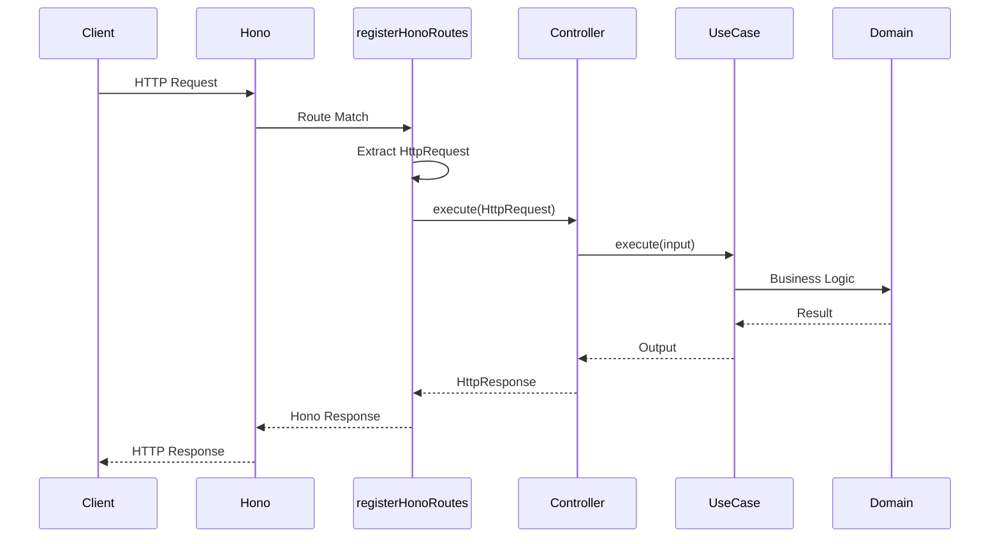
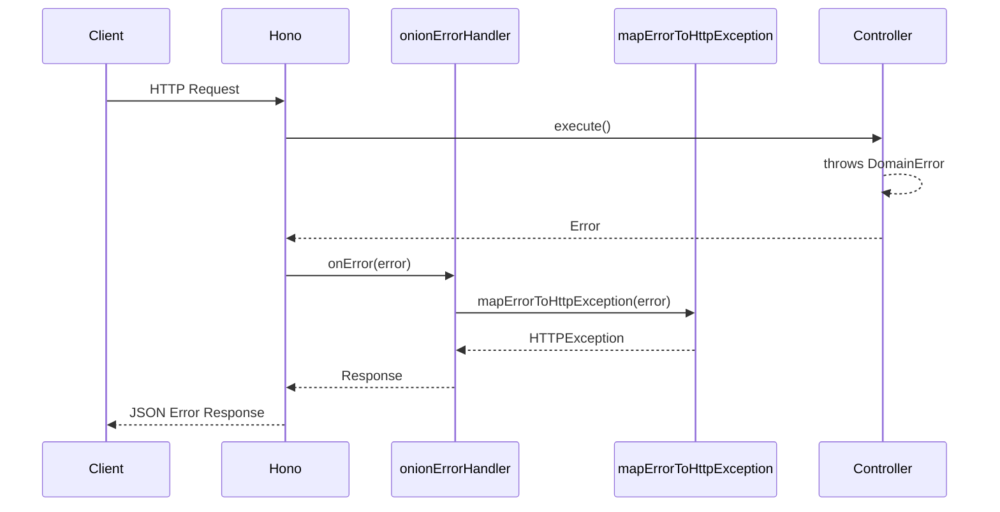
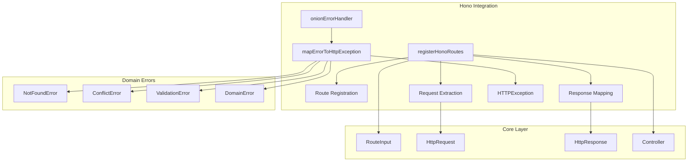
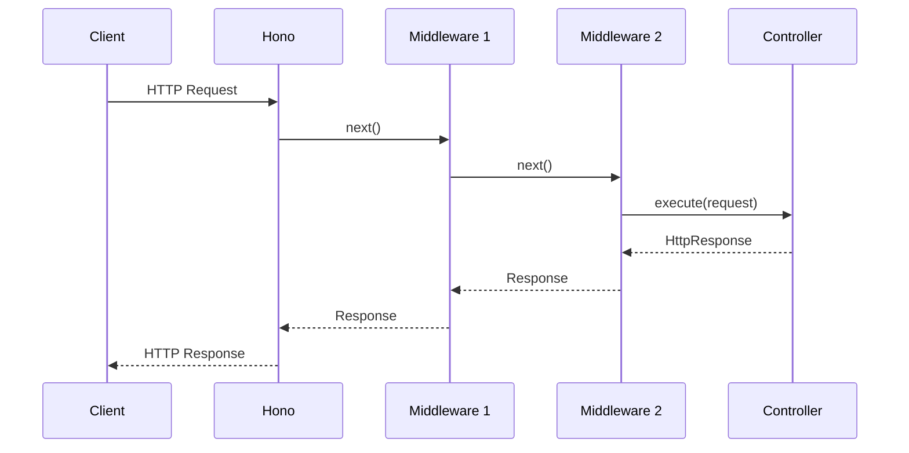
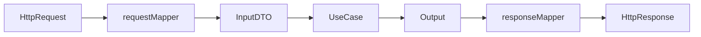
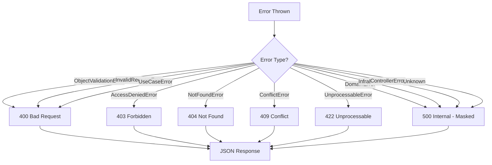
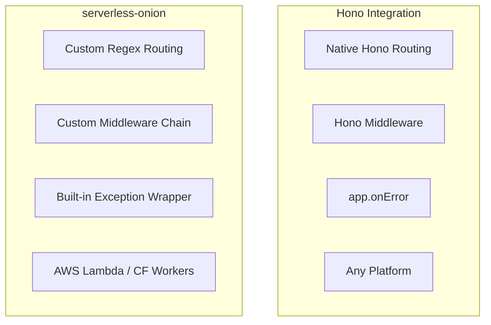

# Hono Framework Integration

> Seamless integration between onion-lasagna architecture and [Hono](https://hono.dev/) - the ultrafast, lightweight web framework.

---

## Table of Contents

- [Overview](#overview)
- [Architecture](#architecture)
- [Installation](#installation)
- [Quick Start](#quick-start)
- [Middleware Support](#middleware-support)
- [API Reference](#api-reference)
- [Controller Pattern](#controller-pattern)
- [Error Handling](#error-handling)
- [Complete Example](#complete-example)
- [Deployment](#deployment)
- [Comparison](#comparison)

---

## Overview

This integration bridges the onion-lasagna clean architecture with Hono's powerful routing system, providing:

| Feature                            | Description                                                 |
| ---------------------------------- | ----------------------------------------------------------- |
| **Flexible Route Registration**    | Register a single route or an array of routes in one call   |
| **Middleware Support**             | Attach Hono middlewares to route groups                     |
| **Automatic Path Conversion**      | Converts `{param}` syntax to Hono's `:param` format         |
| **Error Mapping**                  | Maps domain errors to appropriate HTTP responses            |
| **Framework Agnostic Controllers** | Use the same controller pattern across different frameworks |

---

## Architecture

### Request Flow



### Error Handling Flow



### Module Structure



---

## Installation

Ensure `hono` is installed in your project:

```bash
# Using pnpm
pnpm add hono

# Using bun
bun add hono

# Using npm
npm install hono
```

---

## Quick Start

```typescript
import { Hono } from 'hono';
import {
  registerHonoRoutes,
  onionErrorHandler,
} from '@cosmneo/onion-lasagna/backend/frameworks/hono';

const app = new Hono();

// 1. Apply error handler
app.onError(onionErrorHandler);

// 2. Register routes (array)
registerHonoRoutes(app, [
  { metadata: { path: '/users', method: 'POST' }, controller: createUserController },
  { metadata: { path: '/users/{id}', method: 'GET' }, controller: getUserController },
  { metadata: { path: '/users/{id}', method: 'PUT' }, controller: updateUserController },
  { metadata: { path: '/users/{id}', method: 'DELETE' }, controller: deleteUserController },
]);

// 3. Or register a single route
registerHonoRoutes(app, {
  metadata: { path: '/health', method: 'GET' },
  controller: healthController,
});

export default app;
```

---

## Middleware Support

Attach Hono middlewares to specific route groups using the `middlewares` option. Middlewares run **before** the controller handler for all routes in that registration.

### Basic Usage

```typescript
import { jwt } from 'hono/jwt';
import { logger } from 'hono/logger';

// Protected routes - JWT middleware applied to all
registerHonoRoutes(app, userRoutes, {
  middlewares: [jwt({ secret: 'my-secret' })],
});
```

### Multiple Middlewares

Middlewares execute in order (left to right):

```typescript
import { jwt } from 'hono/jwt';
import { logger } from 'hono/logger';
import { rateLimiter } from './middlewares/rate-limiter';

registerHonoRoutes(app, apiRoutes, {
  middlewares: [logger(), rateLimiter(), jwt({ secret: 'my-secret' })],
});
// Order: logger → rateLimiter → jwt → controller
```

### Public vs Protected Routes

```typescript
const app = new Hono();

app.onError(onionErrorHandler);

// ─────────────────────────────────────────────────────────────
// Public routes - no authentication
// ─────────────────────────────────────────────────────────────
registerHonoRoutes(app, [
  { metadata: { path: '/health', method: 'GET' }, controller: healthController },
  { metadata: { path: '/auth/login', method: 'POST' }, controller: loginController },
  { metadata: { path: '/auth/register', method: 'POST' }, controller: registerController },
]);

// ─────────────────────────────────────────────────────────────
// Protected routes - require authentication
// ─────────────────────────────────────────────────────────────
const authMiddleware = jwt({ secret: process.env.JWT_SECRET! });

registerHonoRoutes(app, userRoutes, { middlewares: [authMiddleware] });
registerHonoRoutes(app, orderRoutes, { middlewares: [authMiddleware] });
registerHonoRoutes(app, productRoutes, { middlewares: [authMiddleware] });

// ─────────────────────────────────────────────────────────────
// Admin routes - require authentication + admin role
// ─────────────────────────────────────────────────────────────
registerHonoRoutes(app, adminRoutes, {
  middlewares: [authMiddleware, requireRole('admin')],
});

export default app;
```

### Middleware Flow Diagram



### Available Hono Middlewares

| Middleware     | Import                | Description                   |
| -------------- | --------------------- | ----------------------------- |
| JWT            | `hono/jwt`            | JSON Web Token authentication |
| Bearer Auth    | `hono/bearer-auth`    | Bearer token authentication   |
| Basic Auth     | `hono/basic-auth`     | HTTP Basic authentication     |
| CORS           | `hono/cors`           | Cross-Origin Resource Sharing |
| Logger         | `hono/logger`         | Request/response logging      |
| Pretty JSON    | `hono/pretty-json`    | Format JSON responses         |
| Compress       | `hono/compress`       | Response compression          |
| Cache          | `hono/cache`          | Response caching              |
| ETag           | `hono/etag`           | ETag header support           |
| Secure Headers | `hono/secure-headers` | Security headers              |

> See [Hono Middleware Documentation](https://hono.dev/docs/middleware/builtin/basic-auth) for the complete list.

---

## API Reference

### `registerHonoRoutes(app, routes, options?)`

Registers routes onto a Hono app. Accepts either a single route or an array of routes.

```typescript
function registerHonoRoutes(
  app: Hono,
  routes: RouteInput<HttpController> | RouteInput<HttpController>[],
  options?: RegisterRoutesOptions,
): void;

interface RegisterRoutesOptions {
  middlewares?: HonoMiddleware[];
}
```

| Parameter              | Type                | Description                                 |
| ---------------------- | ------------------- | ------------------------------------------- |
| `app`                  | `Hono`              | The Hono app instance (passed by reference) |
| `routes`               | `RouteInputOrArray` | A single route or an array of routes        |
| `options?.middlewares` | `HonoMiddleware[]`  | Middlewares applied to all routes           |

#### Path Conversion

The function automatically converts onion-lasagna path syntax to Hono format:

| Input                              | Output                           |
| ---------------------------------- | -------------------------------- |
| `/users/{id}`                      | `/users/:id`                     |
| `/orders/{orderId}/items/{itemId}` | `/orders/:orderId/items/:itemId` |

#### Examples

**Single route:**

```typescript
registerHonoRoutes(app, {
  metadata: { path: '/health', method: 'GET' },
  controller: healthController,
});
```

**Array of routes:**

```typescript
registerHonoRoutes(app, [
  { metadata: { path: '/users', method: 'POST' }, controller: createUserController },
  { metadata: { path: '/users/{id}', method: 'GET' }, controller: getUserController },
]);
```

**Multiple domains:**

```typescript
registerHonoRoutes(app, userRoutes);
registerHonoRoutes(app, orderRoutes);
registerHonoRoutes(app, productRoutes);
```

---

### `onionErrorHandler(error, context)`

Error handler that maps domain errors to HTTP responses.

```typescript
function onionErrorHandler(error: Error | HTTPException, context: Context): Response;
```

**Usage:**

```typescript
app.onError(onionErrorHandler);
```

---

### `mapErrorToHttpException(error)`

Converts domain/use-case errors to Hono's `HTTPException`.

```typescript
function mapErrorToHttpException(error: unknown): HTTPException;
```

---

### `HttpController`

Type alias for controllers that work with HTTP request/response:

```typescript
type HttpController = Controller<HttpRequest, HttpResponse>;
```

---

## Controller Pattern

### Basic Controller

```typescript
import type { HttpController } from '@cosmneo/onion-lasagna/backend/frameworks/hono';

const getUserController: HttpController = {
  async execute(request) {
    const userId = request.pathParams?.id as string;
    const user = await getUserUseCase.execute({ id: userId });

    return {
      statusCode: 200,
      body: user,
    };
  },
};
```

### Using BaseController

For a more structured approach with request mapping and validation:

```typescript
import { BaseController } from '@cosmneo/onion-lasagna/backend/core/presentation';

const createUserController = BaseController.create({
  requestMapper: (request) => CreateUserInputDto.create(request.body),
  useCase: createUserUseCase,
  responseMapper: (output) => ({
    statusCode: 201,
    body: { id: output.value.id },
  }),
});
```

### Controller Flow



---

## Error Handling

### Error Mapping Table

| Error Type              | HTTP Status | Masked  | Description                |
| ----------------------- | :---------: | :-----: | -------------------------- |
| `ObjectValidationError` |    `400`    |   No    | Schema validation failed   |
| `InvalidRequestError`   |    `400`    |   No    | Request validation failed  |
| `AccessDeniedError`     |    `403`    |   No    | Authorization failed       |
| `NotFoundError`         |    `404`    |   No    | Resource not found         |
| `ConflictError`         |    `409`    |   No    | Resource conflict          |
| `UnprocessableError`    |    `422`    |   No    | Business rule violation    |
| `UseCaseError`          |    `400`    |   No    | Use case failure           |
| `DomainError`           |    `500`    | **Yes** | Domain invariant violation |
| `InfraError`            |    `500`    | **Yes** | Infrastructure failure     |
| `ControllerError`       |    `500`    | **Yes** | Controller failure         |
| Unknown                 |    `500`    | **Yes** | Unexpected error           |

> **Security Note:** Internal errors (Domain, Infra, Controller) are masked to prevent leaking implementation details. The response shows "An unexpected error occurred" while the original error is preserved in the `cause` for logging.

### Error Response Format

```json
{
  "message": "User not found",
  "errorCode": "USER_NOT_FOUND",
  "errorItems": [{ "item": "email", "message": "Invalid email format" }]
}
```

### Error Flow Diagram



---

## Complete Example

### Project Structure

```
src/
├── domains/
│   └── user/
│       ├── controllers/
│       │   ├── create-user.controller.ts
│       │   ├── get-user.controller.ts
│       │   └── index.ts
│       ├── routes.ts
│       └── use-cases/
│           └── ...
├── app.ts
└── server.ts
```

### Define Routes

```typescript
// domains/user/routes.ts
import type { RouteInput } from '@cosmneo/onion-lasagna/backend/core/presentation';
import type { HttpController } from '@cosmneo/onion-lasagna/backend/frameworks/hono';
import {
  createUserController,
  getUserController,
  updateUserController,
  deleteUserController,
} from './controllers';

export const userRoutes: RouteInput<HttpController>[] = [
  {
    metadata: { path: '/users', method: 'POST' },
    controller: createUserController,
  },
  {
    metadata: { path: '/users', method: 'GET' },
    controller: listUsersController,
  },
  {
    metadata: { path: '/users/{id}', method: 'GET' },
    controller: getUserController,
  },
  {
    metadata: { path: '/users/{id}', method: 'PUT' },
    controller: updateUserController,
  },
  {
    metadata: { path: '/users/{id}', method: 'DELETE' },
    controller: deleteUserController,
  },
];
```

### Create Controller

```typescript
// domains/user/controllers/get-user.controller.ts
import { BaseController } from '@cosmneo/onion-lasagna/backend/core/presentation';
import { NotFoundError } from '@cosmneo/onion-lasagna/backend/core/onion-layers';
import { getUserUseCase } from '../use-cases';

export const getUserController = BaseController.create({
  requestMapper: (request) => ({
    id: request.pathParams?.id as string,
  }),

  useCase: getUserUseCase,

  responseMapper: (output) => {
    if (!output.value) {
      throw new NotFoundError({
        message: 'User not found',
        code: 'USER_NOT_FOUND',
      });
    }

    return {
      statusCode: 200,
      body: output.value,
    };
  },
});
```

### Bootstrap Application

```typescript
// app.ts
import { Hono } from 'hono';
import { cors } from 'hono/cors';
import { logger } from 'hono/logger';
import {
  registerHonoRoutes,
  onionErrorHandler,
} from '@cosmneo/onion-lasagna/backend/frameworks/hono';

// Import routes from domains
import { userRoutes } from './domains/user/routes';
import { orderRoutes } from './domains/order/routes';
import { productRoutes } from './domains/product/routes';

const app = new Hono();

// ─────────────────────────────────────────────────────────────
// Middleware
// ─────────────────────────────────────────────────────────────
app.use('*', logger());
app.use('*', cors());

// ─────────────────────────────────────────────────────────────
// Error Handling
// ─────────────────────────────────────────────────────────────
app.onError(onionErrorHandler);

// ─────────────────────────────────────────────────────────────
// Routes
// ─────────────────────────────────────────────────────────────
registerHonoRoutes(app, userRoutes);
registerHonoRoutes(app, orderRoutes);
registerHonoRoutes(app, productRoutes);

// ─────────────────────────────────────────────────────────────
// Health Check
// ─────────────────────────────────────────────────────────────
app.get('/health', (c) => c.json({ status: 'ok', timestamp: new Date().toISOString() }));

export default app;
```

---

## Deployment

### Cloudflare Workers

```typescript
// worker.ts
import app from './app';

export default app;
```

```toml
# wrangler.toml
name = "my-api"
main = "src/worker.ts"
compatibility_date = "2024-01-01"
```

### Bun

```typescript
// server.ts
import app from './app';

const server = Bun.serve({
  port: 3000,
  fetch: app.fetch,
});

console.log(`Server running at http://localhost:${server.port}`);
```

### Node.js

```typescript
// server.ts
import { serve } from '@hono/node-server';
import app from './app';

serve({
  fetch: app.fetch,
  port: 3000,
});

console.log('Server running at http://localhost:3000');
```

### Deno

```typescript
// server.ts
import app from './app.ts';

Deno.serve({ port: 3000 }, app.fetch);
```

---

## Request & Response Types

### HttpRequest

```typescript
interface HttpRequest {
  /** Parsed JSON body */
  body?: unknown;

  /** Request headers (lowercase keys) */
  headers?: Record<string, unknown>;

  /** Query string parameters */
  queryParams?: Record<string, unknown>;

  /** Path parameters from route */
  pathParams?: Record<string, unknown>;
}
```

### HttpResponse

```typescript
interface HttpResponse {
  /** HTTP status code */
  statusCode: number;

  /** Response headers */
  headers?: Record<string, unknown>;

  /** Response body (auto-serialized to JSON) */
  body?: unknown;
}
```

---

## Comparison

### Hono Integration vs serverless-onion



| Feature            | Hono Integration |       serverless-onion       |
| ------------------ | :--------------: | :--------------------------: |
| **Use Case**       | Production apps  | Learning / Custom serverless |
| **Routing**        |   Native Hono    |      Custom regex-based      |
| **Middleware**     |  Hono ecosystem  |         Custom chain         |
| **Error Handling** | `app.onError()`  |       Built-in wrapper       |
| **CORS**           |   `hono/cors`    |       Built-in config        |
| **Platforms**      |       Any        |    AWS Lambda, CF Workers    |
| **Maturity**       | Production-ready |         Experimental         |

> **Recommendation:** Use the Hono integration for production applications. It leverages Hono's mature ecosystem while maintaining the onion architecture's clean separation of concerns.

---

## License

MIT
