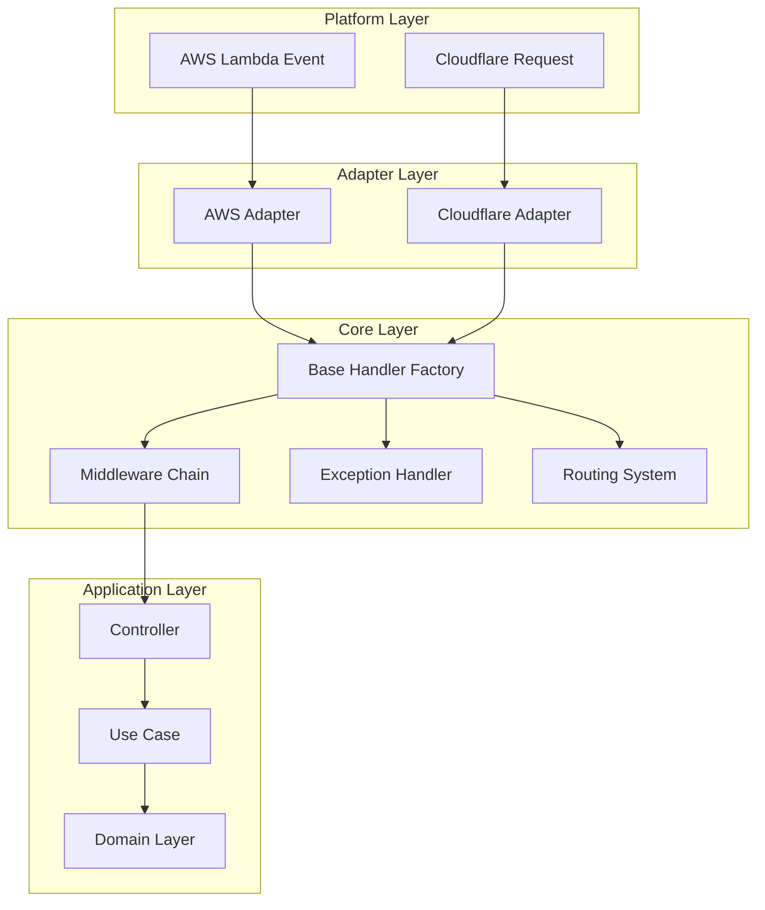
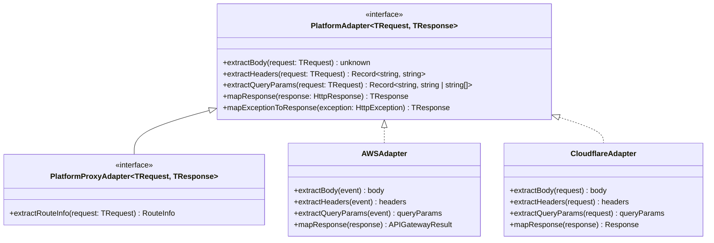
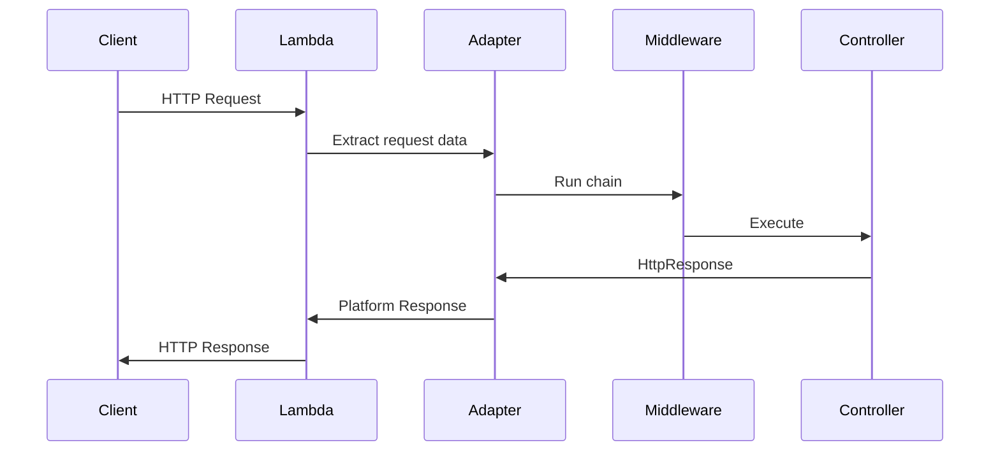
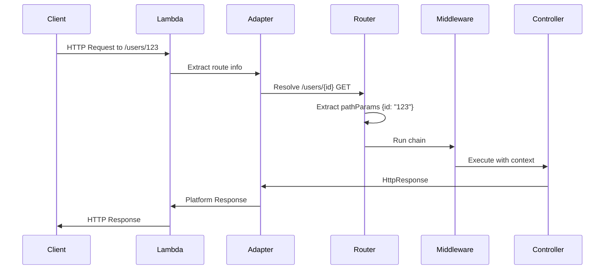
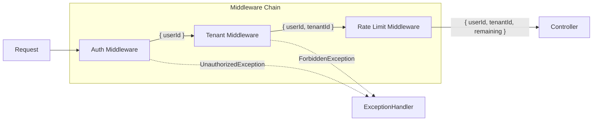
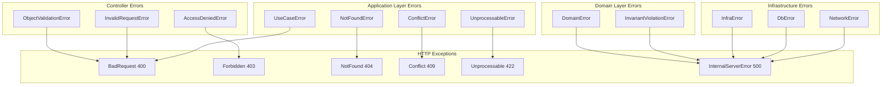
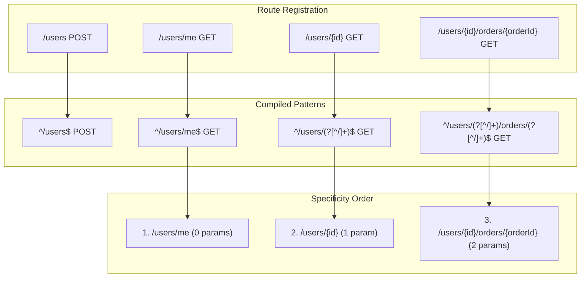
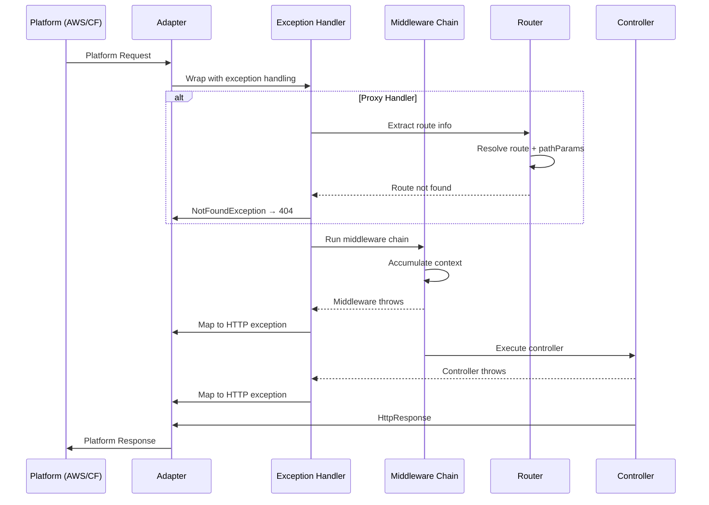
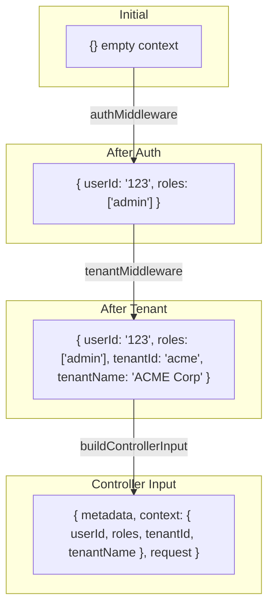

# Serverless-Onion Framework

> **⚠️ Educational Project - Not Recommended for Production Use**
>
> This framework was built primarily for **educational purposes** to demonstrate how to build platform-agnostic serverless handlers using the adapter pattern. For production applications, consider using battle-tested frameworks like [Hono](https://hono.dev/), [Fastify](https://fastify.dev/), or [tRPC](https://trpc.io/).
>
> **When to use this framework:**
>
> - Learning how serverless adapters work under the hood
> - Understanding the adapter pattern in TypeScript
> - Building a custom framework where you need full control
> - Distributing a library that can't assume external dependencies
>
> **When to use Hono/Fastify instead:**
>
> - Production applications
> - When you need a mature ecosystem of middlewares
> - When you want comprehensive documentation and community support
> - When you need battle-tested routing with edge cases handled

---

## Table of Contents

1. [Overview](#overview)
2. [Architecture](#architecture)
3. [Core Concepts](#core-concepts)
   - [Platform Adapter Pattern](#platform-adapter-pattern)
   - [Handler Factories](#handler-factories)
   - [Middleware System](#middleware-system)
   - [Exception Handling](#exception-handling)
   - [Routing System](#routing-system)
4. [Supported Platforms](#supported-platforms)
5. [Usage Examples](#usage-examples)
6. [Comparison with Alternatives](#comparison-with-alternatives)
7. [Internals Deep Dive](#internals-deep-dive)
8. [Adding New Platforms](#adding-new-platforms)

---

## Overview

Serverless-Onion is a lightweight, platform-agnostic framework for building serverless HTTP handlers. It provides a clean abstraction layer that allows the same controller logic to run on multiple serverless platforms (AWS Lambda, Cloudflare Workers) without modification.

### Key Features

| Feature                       | Description                                                     |
| ----------------------------- | --------------------------------------------------------------- |
| **Platform Agnostic**         | Same controller code runs on AWS Lambda and Cloudflare Workers  |
| **Type-Safe Middlewares**     | Middleware context accumulates with full TypeScript inference   |
| **Automatic Error Mapping**   | Domain/infrastructure errors map to HTTP responses              |
| **Path Parameter Extraction** | Routes like `/users/{id}` automatically extract `{ id: "123" }` |
| **Warmup Handling**           | Built-in support for Lambda warmup plugins                      |
| **Zero Runtime Dependencies** | No external dependencies beyond platform SDKs                   |

### Architecture Overview



---

## Architecture

### Directory Structure

```
serverless-onion/
├── core/                           # Platform-agnostic core
│   ├── adapters/                   # Response mapping utilities
│   │   └── response/
│   │       ├── map-response-body.util.ts
│   │       └── map-response-headers.util.ts
│   ├── constants/
│   │   └── headers.ts              # Standard HTTP headers
│   ├── exceptions/                 # HTTP exception hierarchy
│   │   ├── http.exception.ts       # Base class
│   │   ├── bad-request.exception.ts
│   │   ├── unauthorized.exception.ts
│   │   ├── forbidden.exception.ts
│   │   ├── not-found.exception.ts
│   │   ├── conflict.exception.ts
│   │   ├── unprocessable-entity.exception.ts
│   │   └── internal-server-error.exception.ts
│   ├── handlers/                   # Handler factories
│   │   ├── types.ts                # PlatformAdapter interfaces
│   │   ├── create-base-handler.ts  # Single-route handler factory
│   │   ├── create-base-proxy-handler.ts  # Multi-route handler factory
│   │   └── build-http-request.ts   # Request building utility
│   ├── mappers/
│   │   └── errors/
│   │       └── map-error-to-exception.ts  # Error → HTTP exception
│   ├── middleware/                 # Middleware system
│   │   ├── types/
│   │   │   ├── middleware.type.ts
│   │   │   └── middleware-chain.type.ts
│   │   ├── define-middleware.ts
│   │   └── run-middleware-chain.ts
│   └── wrappers/
│       └── with-exception-handler.ts
│
├── runtimes/                       # Platform-specific implementations
│   ├── aws-api-gateway-http/       # AWS Lambda + API Gateway v2
│   │   ├── adapters/
│   │   │   ├── request/            # Event → HttpRequest
│   │   │   └── response/           # HttpResponse → APIGatewayResult
│   │   ├── features/
│   │   │   ├── authorizer/         # Lambda authorizer utilities
│   │   │   └── warmup/             # Warmup detection
│   │   ├── handlers/
│   │   │   ├── create-lambda-handler.ts      # Single-route
│   │   │   └── create-greedy-proxy-handler.ts # {proxy+} routing
│   │   └── middleware/
│   │
│   └── cloudflare-workers/         # Cloudflare Workers
│       ├── adapters/
│       │   ├── request/            # Request → HttpRequest
│       │   └── response/           # HttpResponse → Response
│       ├── handlers/
│       │   ├── create-worker-handler.ts       # Single-route
│       │   └── create-worker-proxy-handler.ts # Multi-route
│       └── middleware/
│
└── docs/
    └── adding-a-new-platform.md
```

---

## Core Concepts

### Platform Adapter Pattern

The framework uses the **adapter pattern** to abstract platform-specific request/response handling. Each platform implements the `PlatformAdapter` interface:



#### Interface Definition

```typescript
interface PlatformAdapter<TPlatformRequest, TPlatformResponse> {
  // Request extraction
  extractBody: (request: TPlatformRequest) => unknown | Promise<unknown>;
  extractHeaders: (request: TPlatformRequest) => Record<string, string>;
  extractQueryParams: (request: TPlatformRequest) => Record<string, string | string[]>;

  // Response mapping
  mapResponse: (response: HttpResponse) => TPlatformResponse;
  mapExceptionToResponse: (exception: HttpException) => TPlatformResponse;
}

// Extended for multi-route handlers
interface PlatformProxyAdapter<TPlatformRequest, TPlatformResponse> extends PlatformAdapter<
  TPlatformRequest,
  TPlatformResponse
> {
  extractRouteInfo: (request: TPlatformRequest) => { path: string; method: string };
}
```

---

### Handler Factories

The framework provides two handler factory patterns:

#### 1. Single-Route Handler (`createBaseHandler`)

For Lambda functions that handle one specific route:



**Use case:** One Lambda per endpoint (e.g., `/users` → `createUserLambda`)

#### 2. Proxy/Multi-Route Handler (`createBaseProxyHandler`)

For Lambda functions that handle multiple routes (e.g., `/{proxy+}`):



**Use case:** Single Lambda for entire service (e.g., `UserService/{proxy+}`)

---

### Middleware System

The middleware system provides **type-safe context accumulation**. Each middleware can:

1. Add properties to the execution context
2. Depend on properties from previous middlewares
3. Short-circuit by throwing exceptions



#### Type-Safe Context Accumulation

```typescript
// Define context types (using namespaced keys - see convention below)
interface AuthContext {
  auth: {
    userId: string;
    roles: string[];
  };
}

interface TenantContext {
  tenant: {
    id: string;
    name: string;
  };
}

// Middleware 1: No dependencies
const authMiddleware = defineMiddleware<AuthContext, object, Env>()(
  async (request, env) => {
    const token = request.headers.get('authorization');
    if (!token) {
      throw new UnauthorizedException({ message: 'Missing token', code: 'NO_TOKEN' });
    }
    const user = await validateToken(token);
    return { auth: { userId: user.id, roles: user.roles } };
  }
);

// Middleware 2: Depends on AuthContext
const tenantMiddleware = defineMiddleware<TenantContext, AuthContext, Env>()(
  async (request, env, ctx) => {
    // ctx.auth.userId is typed and available!
    const tenant = await getTenantForUser(ctx.auth.userId, env.DB);
    return { tenant: { id: tenant.id, name: tenant.name } };
  }
);

// Usage: context is { auth: {...}, tenant: {...} }
const handler = createWorkerProxyHandler({
  serviceName: 'MyService',
  routes: [...],
  middlewares: [authMiddleware, tenantMiddleware] as const,
});
```

#### Context Namespacing Convention

To prevent key collisions when multiple middlewares add context, use **namespaced keys**:

```typescript
// GOOD: Namespaced keys prevent collisions
interface AuthContext {
  auth: {
    userId: string;
    roles: string[];
  };
}

interface TenantContext {
  tenant: {
    id: string;
    name: string;
  };
}

const authMiddleware = defineMiddleware<AuthContext, object, Env>()(
  async (request, env) => {
    const user = await validateToken(request.headers.get('authorization'));
    return {
      auth: {
        userId: user.id,
        roles: user.roles,
      },
    };
  }
);

const tenantMiddleware = defineMiddleware<TenantContext, AuthContext, Env>()(
  async (request, env, ctx) => {
    const tenant = await getTenant(ctx.auth.userId);
    return {
      tenant: {
        id: tenant.id,
        name: tenant.name,
      },
    };
  }
);

// Controller access: ctx.auth.userId, ctx.tenant.id
```

**Anti-pattern: Flat keys risk collisions**

```typescript
// BAD: Flat keys can collide between middlewares
interface AuthContext {
  userId: string;  // What if another middleware also uses 'userId'?
  name: string;    // 'name' is very common
}

interface ProfileContext {
  name: string;    // Collision! Overwrites auth.name
  email: string;
}
```

**Benefits of namespacing:**
- Clear ownership: `ctx.auth.*` vs `ctx.tenant.*`
- Self-documenting: obvious which middleware provided data
- Safe merging: no accidental overwrites

#### Recursive Type Accumulation

The `AccumulatedContext` type uses recursive conditional types:

```typescript
type AccumulatedContext<
  TMiddlewares,
  TEnv,
  TRequest,
  TAcc = object,
> = TMiddlewares extends readonly [infer Head, ...infer Tail]
  ? AccumulatedContext<Tail, TEnv, TRequest, TAcc & MiddlewareOutput<Head>>
  : TAcc;

// Example resolution:
// [AuthMiddleware, TenantMiddleware]
// → object & AuthContext & TenantContext
// → { userId: string; roles: string[]; tenantId: string; tenantName: string }
```

---

### Exception Handling

The framework provides automatic mapping from domain/application errors to HTTP exceptions:



#### Security: Error Masking

Internal errors (Domain, Infrastructure) are **masked** to prevent leaking implementation details:

```typescript
// Domain error thrown:
throw new InvariantViolationError({
  message: 'Order total cannot be negative',
  code: 'NEGATIVE_TOTAL',
});

// HTTP response returned:
{
  statusCode: 500,
  message: 'An unexpected error occurred',  // Masked!
  errorCode: 'INTERNAL_ERROR'
}

// Original error logged to console for debugging
```

#### Exception Response Format

```typescript
interface HttpExceptionResponse {
  statusCode: number;
  message: string;
  errorCode: string;
  errorItems?: Array<{
    item: string;
    message: string;
  }>;
}
```

---

### Routing System

The routing system supports:

- **Path parameters**: `/users/{id}`, `/orders/{orderId}/items/{itemId}`
- **Specificity-based matching**: Static routes match before dynamic
- **Method filtering**: Routes are indexed by HTTP method



#### Path Parameter Extraction

```typescript
// Route definition
const routes = [
  { metadata: { servicePath: '/users/{userId}/orders/{orderId}', method: 'GET' }, controller },
];

// Incoming request: GET /users/abc123/orders/xyz789

// Resolved:
{
  route: { /* matched route */ },
  pathParams: { userId: 'abc123', orderId: 'xyz789' }
}
```

---

## Supported Platforms

### AWS Lambda (API Gateway v2 HTTP)

```typescript
import {
  createLambdaHandler,
  createGreedyProxyHandler,
  defineMiddleware,
  mapRequest,
} from '@cosmneo/onion-lasagna/backend/frameworks/serverless-onion/aws';

// Single-route handler
export const handler = createLambdaHandler({
  controller: myController,
  handleWarmup: true,
});

// Multi-route handler (/{proxy+})
export const handler = createGreedyProxyHandler({
  serviceName: 'UserService',
  routes: [
    { metadata: { servicePath: '/users', method: 'POST' }, controller: createUserController },
    { metadata: { servicePath: '/users/{id}', method: 'GET' }, controller: getUserController },
  ],
  middlewares: [authMiddleware] as const,
});
```

**Platform Features:**

- Warmup detection (`serverless-plugin-warmup` compatible)
- Lambda authorizer context extraction
- Base64 body decoding
- Multi-value header support

### Cloudflare Workers

```typescript
import {
  createWorkerHandler,
  createWorkerProxyHandler,
  defineMiddleware,
  mapRequest,
} from '@cosmneo/onion-lasagna/backend/frameworks/serverless-onion/cloudflare';

// Single-route handler
export default {
  fetch: createWorkerHandler({
    controller: myController,
  }),
};

// Multi-route handler
export default {
  fetch: createWorkerProxyHandler({
    serviceName: 'UserService',
    routes: [...],
    middlewares: [authMiddleware] as const,
  }),
};
```

**Platform Features:**

- Environment bindings (KV, D1, R2, etc.) in middleware context
- Web API Request/Response
- Async body reading

---

## Usage Examples

### Basic Handler

```typescript
import { createLambdaHandler, mapRequest } from '../serverless-onion/aws';

// Controller from onion-layers
const getUserController = {
  execute: async (input: { request: HttpRequest; pathParams: Record<string, string> }) => {
    const user = await userService.findById(input.pathParams.id);
    return {
      statusCode: 200,
      body: user,
    };
  },
};

// Lambda handler
export const handler = createLambdaHandler({
  controller: getUserController,
});
```

### With Middleware Chain

```typescript
import { createGreedyProxyHandler, defineMiddleware } from '../serverless-onion/aws';

// Auth middleware (namespaced context)
interface AuthContext {
  auth: { userId: string };
}

const authMiddleware = defineMiddleware<AuthContext, object, undefined>()(async (event) => {
  const token = event.headers?.authorization;
  if (!token) {
    throw new UnauthorizedException({ message: 'Missing token', code: 'NO_TOKEN' });
  }
  return { auth: { userId: await validateToken(token) } };
});

// Rate limit middleware (depends on auth, namespaced context)
interface RateLimitContext {
  rateLimit: { remaining: number };
}

const rateLimitMiddleware = defineMiddleware<RateLimitContext, AuthContext>()(async (
  event,
  env,
  ctx,
) => {
  const remaining = await checkRateLimit(ctx.auth.userId);
  if (remaining <= 0) {
    throw new ForbiddenException({ message: 'Rate limited', code: 'RATE_LIMITED' });
  }
  return { rateLimit: { remaining } };
});

// Handler with middleware chain
export const handler = createGreedyProxyHandler({
  serviceName: 'UserService',
  routes: [
    { metadata: { servicePath: '/users', method: 'GET' }, controller: listUsersController },
    { metadata: { servicePath: '/users/{id}', method: 'GET' }, controller: getUserController },
  ],
  middlewares: [authMiddleware, rateLimitMiddleware] as const,
});
// Controller receives: ctx.auth.userId, ctx.rateLimit.remaining
```

### Custom Input Mapping

```typescript
export const handler = createLambdaHandler({
  controller: myController,
  mapInput: async (event, env, ctx) => ({
    body: JSON.parse(event.body ?? '{}'),
    headers: event.headers ?? {},
    queryParams: event.queryStringParameters ?? {},
    userId: ctx.auth.userId, // From auth middleware (namespaced)
    requestId: event.requestContext.requestId,
  }),
});
```

### Custom Output Mapping

```typescript
export const handler = createLambdaHandler({
  controller: myController,
  mapOutput: (result) => ({
    statusCode: 201,
    body: result,
    headers: {
      Location: `/users/${result.id}`,
      'X-Request-Id': result.requestId,
    },
  }),
});
```

---

## Comparison with Alternatives

### vs Hono

| Aspect                   | Serverless-Onion    | Hono                                |
| ------------------------ | ------------------- | ----------------------------------- |
| **Maturity**             | Experimental        | Production-ready                    |
| **Community**            | None                | Large, active                       |
| **Platform Support**     | 2 (AWS, Cloudflare) | 10+                                 |
| **Routing Features**     | Basic path params   | Full (regex, wildcards, groups)     |
| **Middleware Ecosystem** | None                | Extensive (cors, jwt, zod, openapi) |
| **Documentation**        | Minimal             | Comprehensive                       |
| **Dependencies**         | Zero                | Minimal                             |
| **Bundle Size**          | ~15KB               | ~14KB                               |
| **Type Safety**          | Full                | Full                                |

**Recommendation:** Use Hono for production. Use serverless-onion for learning or when you need zero external dependencies.

### Hybrid Approach

You can use Hono for routing and serverless-onion's onion-layers for domain logic:

```typescript
import { Hono } from 'hono';
import { createUserController } from './controllers/create-user.controller';

const app = new Hono();

app.post('/users', async (c) => {
  const result = await createUserController.execute({
    body: await c.req.json(),
    headers: Object.fromEntries(c.req.raw.headers),
  });
  return c.json(result.body, result.statusCode);
});

export default app;
```

---

## Internals Deep Dive

### Request Flow



### Exception Handler Wrapper

The exception handler is a higher-order function that wraps any async handler:

```typescript
const withExceptionHandler = createExceptionHandler<Response>({
  mapExceptionToResponse: (exception) =>
    new Response(JSON.stringify(exception.toResponse()), {
      status: exception.statusCode,
    }),
});

// Wrapping
const safeHandler = withExceptionHandler(async (request) => {
  // This code is now protected
  throw new Error('Boom!');
  // → Caught, mapped to InternalServerErrorException
  // → Response: { statusCode: 500, message: 'An unexpected error occurred' }
});
```

### Middleware Context Flow



---

## Adding New Platforms

See [docs/adding-a-new-platform.md](./docs/adding-a-new-platform.md) for a complete guide.

### Quick Example: Deno Deploy

```typescript
import { createBaseProxyHandler, type PlatformProxyAdapter } from '../core/handlers';

const denoAdapter: PlatformProxyAdapter<Request, Response> = {
  extractRouteInfo: (request) => ({
    path: new URL(request.url).pathname,
    method: request.method,
  }),
  extractBody: async (request) => {
    try {
      return await request.clone().json();
    } catch {
      return undefined;
    }
  },
  extractHeaders: (request) => Object.fromEntries(request.headers.entries()),
  extractQueryParams: (request) => Object.fromEntries(new URL(request.url).searchParams),
  mapResponse: (response) =>
    new Response(JSON.stringify(response.body), {
      status: response.statusCode,
      headers: { 'Content-Type': 'application/json' },
    }),
  mapExceptionToResponse: (exception) =>
    new Response(JSON.stringify(exception.toResponse()), {
      status: exception.statusCode,
      headers: { 'Content-Type': 'application/json' },
    }),
};

export function createDenoHandler(config) {
  const factory = createBaseProxyHandler<Request, Response, undefined>(denoAdapter);
  return factory(config);
}
```

---

## API Reference

### Core Exports

```typescript
import {
  // Handler factories
  createBaseHandler,
  createBaseProxyHandler,
  buildHttpRequest,

  // Exceptions
  HttpException,
  BadRequestException,
  UnauthorizedException,
  ForbiddenException,
  NotFoundException,
  ConflictException,
  UnprocessableEntityException,
  InternalServerErrorException,

  // Middleware
  defineMiddleware,
  runMiddlewareChain,

  // Error mapping
  mapErrorToException,
  createExceptionHandler,

  // Types
  type PlatformAdapter,
  type PlatformProxyAdapter,
  type Middleware,
  type AccumulatedContext,
} from '@cosmneo/onion-lasagna/backend/frameworks/serverless-onion/core';
```

### AWS Exports

```typescript
import {
  createLambdaHandler,
  createGreedyProxyHandler,
  defineMiddleware,
  mapRequest,
  mapRequestBody,
  mapRequestHeaders,
  mapRequestQueryParams,
  mapRequestPathParams,
  mapResponse,
  isWarmupCall,
  getWarmupResponse,
} from '@cosmneo/onion-lasagna/backend/frameworks/serverless-onion/aws';
```

### Cloudflare Exports

```typescript
import {
  createWorkerHandler,
  createWorkerProxyHandler,
  defineMiddleware,
  mapRequest,
  mapRequestBody,
  mapRequestHeaders,
  mapRequestQueryParams,
  mapResponse,
} from '@cosmneo/onion-lasagna/backend/frameworks/serverless-onion/cloudflare';
```

---

## License

MIT

---

## Contributing

This is an educational project. Contributions are welcome, but please note:

1. This is not intended for production use
2. Keep the codebase simple and educational
3. Document any new concepts thoroughly
4. Add mermaid diagrams where helpful
